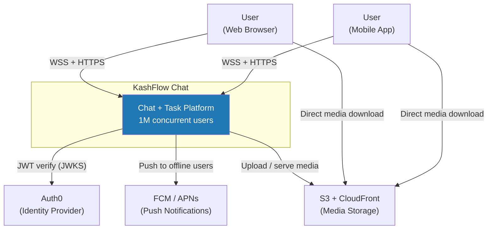
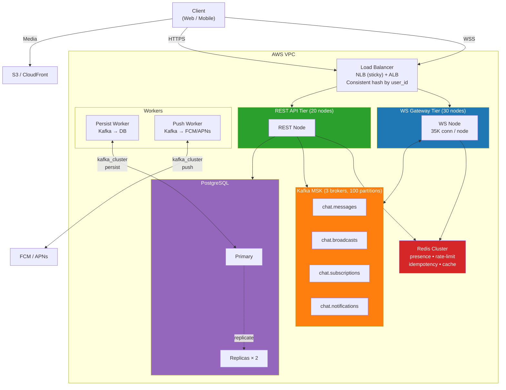
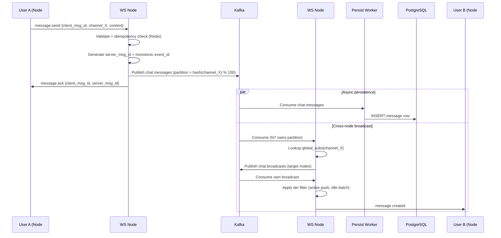

# KashFlow Chat

> A real-time collaborative chat + task platform engineered for **1 million concurrent WebSocket connections**.
> Every architectural decision is benchmarked against that target.

[](https://go.dev)
[](https://www.postgresql.org)
[](https://kafka.apache.org)
[](https://redis.io)
[](LICENSE)

---

## Why this project

Most "chat app" tutorials run on a single server with `goroutine-per-connection` and call it done. This project takes the opposite path: **design from day one for the architecture that survives at 1M concurrent users**, even though the test environment can only verify ~3,000.

The result is a documented, derivation-backed design for distributed WebSocket gateways, cross-node fan-out via Kafka, tiered delivery for hot channels, and stateless reconnect-resync — the exact problem set Slack, Discord, and WhatsApp solve in production.

---

## Headline numbers

| Metric | Target | Derivation |
|---|---|---|
| Concurrent connections | **1,000,000** | 5M MAU × 50% DAU × 40% peak factor |
| Peak message broadcasts | **750K events/sec** | 50K send/sec × effective fan-out 15 (active subscribers only) |
| End-to-end latency p50 | **< 100 ms** | WS frame + Kafka publish + cross-node consume + fan-out |
| Connection memory | **~36 KB / connection** | Goroutine stacks + buffers + metadata |
| Cluster footprint | **~30 WS nodes** | 35K connections per node, 5% headroom |
| Hot channel reduction | **96 %** | Tiered delivery vs naive fan-out (5000 subscribers) |
| Storage growth | **~28 TB / year** | 75M messages/day × 700 B per row (incl. indexes) |
| SLA | **99.95 %** | Per-feature: send/receive 99.99 %, search 99.5 % |

---

## Architecture

### System Context



### Container View



### Send-Message Flow (cross-node)



> Latency budget verified: ~40-70 ms p50 from sender to receiver, well within 100 ms target.

For full design — including 3 more sequence diagrams, component-level decomposition, all 4 hard parts, 12 failure modes, and design alternatives considered — see [`docs/chat-system-design.md`](docs/chat-system-design.md).

---

## Engineering Highlights

The 4 hard problems this design solves — each was an open question that drove architecture decisions:

### HP1 — Subscription Routing across 30 Nodes

**Problem**: When user A on node #1 sends to channel X, which of the 30 nodes have subscribers of X?

**Solution**: Hybrid Kafka-partitioned routing. 100 Kafka partitions hashed by `channel_id`; 30 WS nodes form a consumer group. Each node maintains:
- `local_subs[channel_id] → [conn_list]` for immediate fan-out
- `global_subs[channel_id] → [node_list]` synced via gossip on a separate Kafka topic

Result: routing lookup is in-RAM (nanoseconds), no central registry, automatic rebalance on node up/down.

### HP2 — Hot-Channel Fan-out (96% reduction)

**Problem**: A 5000-member channel × 50 msg/sec = 250K events/sec naive fan-out. Bandwidth and CPU exhausted.

**Solution**: Three-tier delivery driven by per-(connection × channel) focus state:

| Tier | Trigger | Delivery |
|---|---|---|
| Active | Channel currently focused on user UI | Real-time WS push (<200 ms) |
| Idle | WS connected, channel in background | Batched count + last preview every 5-30 s |
| Offline | WS disconnected | Mobile push for mention/DM only; replay on reconnect |

Result: 250K events/sec → 10K events/sec (96% reduction), with state stored locally per-connection instead of in Redis (avoiding 100M write-ops/day to Redis from tab switches).

### HP3 — Stateless Reconnect-Resync

**Problem**: User offline 30 s, missed events 103-105, reconnects to a different node. Must deliver all missed events with no miss, no duplicate, in correct order, in <1s.

**Solution**: Client-tracked cursor (server-side delivery tracking would cost 37.5M writes/sec — impossible). On reconnect:
- WS subscribes to live broadcasts immediately, client buffers without rendering
- REST `/messages?after={cursor}` fetches gap in parallel
- Client merges + dedups by `event_id`, sorts, renders

Result: server stateless for per-user delivery, scales linearly. Latency-to-first-new-message = WS RTT, independent of REST roundtrip.

### HP4 — Backpressure & Slow-Consumer Isolation

**Problem**: One slow user (weak network) fills the per-connection outbound buffer; without isolation, head-of-line blocking starves the other 199 active users in the channel.

**Solution**: Bounded outbound buffer (1000 events / 5 MB / 10 s write timeout — whichever hits first) → close WS with code 4408 → client reconnects → HP3 resync recovers all missed events.

Critical insight: **lossy drop strategies break HP3's monotonic event_id invariant**. Cross-HP consistency analysis ruled them out. Disconnect + replay is the only design that preserves both isolation and ordering guarantees.

---

## Stack

| Layer | Technology | Why |
|---|---|---|
| Language | **Go 1.25** | Goroutine concurrency model, native WebSocket performance, compiled binary |
| HTTP / Router | **Gin** | High-throughput HTTP framework, middleware ecosystem |
| WebSocket | **gorilla/websocket** | Battle-tested, 35K conn/node achievable. Migration path to `gobwas/ws` documented if RAM-bound |
| ORM | **GORM** | Type-safe queries, migration support |
| Database | **PostgreSQL 16** | Time-partitioned message storage (T16), GIN full-text search |
| Cache | **Redis Cluster** | Presence, rate limit, idempotency, hot data cache |
| Message Broker | **Apache Kafka (sarama)** | Cross-node fan-out, message replay window, partition-based sharding |
| Auth | **Auth0** | RS256 JWT verification via JWKS, no password storage server-side |
| DI | **uber/fx** | Compile-time dependency graph, testable wiring |
| Migrations | **golang-migrate** | Versioned schema, repeatable across environments |

---

## Architecture Principles

These rules are non-negotiable across the codebase:

1. **Layered request flow**: `Route → Middleware → Handler → Service → Repository`. Skip a layer = reject in code review.
2. **Interfaces everywhere**: services and repositories expose `IXxxService` / `IXxxRepository`. Concrete types are package-private.
3. **TDD required**: write the test first, then the minimum code to pass, then refactor.
4. **Multi-tenant isolation**: every query passes `workspace_id` — enforced at repository layer, not application code.
5. **DB writes off the critical path**: WebSocket message send acknowledges after Kafka publish; persistence is async. DB outage degrades gracefully.
6. **Code runs identically on 1 node or 30 nodes**: no `if single_node {} else {}` branches. Multi-node is the default; single-node is a degenerate case.

---

## Performance Targets

| Latency Class | p50 | p99 |
|---|---|---|
| Hot-path message (sender → receiver) | < 80 ms | < 200 ms |
| Typing / presence | — | < 200 ms |
| Reaction broadcast | — | < 200 ms |
| Notification (mention, task) | < 300 ms | < 1 s |
| Read receipt batch | — | < 5 s (acceptable) |
| Cold connection establishment | < 500 ms | < 1 s |
| Reconnect (warm) | < 300 ms | < 800 ms |

| Throughput | Sustained | Peak |
|---|---|---|
| Messages sent (C → S) | 20K / sec | 50K / sec |
| Broadcast events (S → C) | 250K / sec | 750K / sec |
| Daily message volume | — | 75M / day |

---

## Project Status

| Sprint | Tasks | Status |
|---|---|---|
| Sprint 1 | Auth foundation + Docker dev env (T01-T04, T38) | ✅ Done |
| Sprint 2 | Workspace + RBAC + CI pipeline (T05-T08, T47-T48) | ✅ Done |
| Sprint 3 | **WebSocket + Kafka architecture design (T09-T11)** | 🚧 In progress (T09 design done) |
| Sprint 4 | Chat core: messages + channels (T12-T16) | ⏳ Planned |
| Sprint 5+ | Real-time features, search, scaling, deployment | ⏳ Planned |

Detailed task breakdown: [`docs/task-breakdown.md`](docs/task-breakdown.md)

---

## Getting Started

### Prerequisites

- Go 1.25+
- Docker + Docker Compose
- Make

### Quickstart

```bash
# Clone and enter the project
git clone https://github.com/<your-handle>/todo-chat-app.git
cd todo-chat-app

# Copy environment template
cp .env.example .env
# Edit .env with your Auth0 credentials

# Spin up dependencies (Postgres, Redis, Kafka, Zookeeper)
docker compose up -d

# Run database migrations
make migrate-up

# Start the API server
make run

# In another terminal: run the test suite
make test
```

### Common Commands

```bash
make run           # Start the API server
make test          # Run all tests with race detector
make test-coverage # Generate HTML coverage report
make lint          # Run golangci-lint
make migrate-up    # Apply pending migrations
make migrate-down  # Roll back the latest migration
make build         # Build a production binary
```

---

## Documentation

| Document | Purpose |
|---|---|
| [`docs/chat-system-design.md`](docs/chat-system-design.md) | T09 WebSocket architecture — full 7-step design (functional, scale, constraints, hard parts, options, failure modes, diagrams) |
| [`docs/architecture.md`](docs/architecture.md) | Overall system architecture and risk analysis |
| [`docs/task-breakdown.md`](docs/task-breakdown.md) | Sprint plan, task estimation, dependency graph |
| [`docs/task-breakdown-fullstack.md`](docs/task-breakdown-fullstack.md) | Full-stack scope including frontend |
| [`docs/frontend-guide.md`](docs/frontend-guide.md) | Frontend implementation guide |
| [`docs/e2ee-plan.md`](docs/e2ee-plan.md) | End-to-end encryption roadmap (Signal Protocol) |
| [`docs/testing-guide-90-coverage.md`](docs/testing-guide-90-coverage.md) | Testing standards and coverage targets |
| [`AGENTS.md`](AGENTS.md) | Engineering rules, code review checklist, TDD workflow |

---

## Roadmap

- **Sprint 4-6**: Real-time chat core (messages, channels, DM, typing, presence, reactions, threads)
- **Sprint 7-9**: Task management (CRUD, kanban, status workflow, comments, search)
- **Sprint 10-11**: Load test → 1M concurrent verification → AWS production deployment
- **Sprint 12-13**: Notifications + third-party integrations (Google, Spotify, webhooks)
- **Sprint 14-17**: End-to-end encryption (Signal Protocol — DM and group)

Full roadmap: [`docs/task-breakdown.md`](docs/task-breakdown.md)

---

## Why This Stack at 1M Concurrent

Choosing a stack at scale is choosing tradeoffs. The decisions documented here are not "best in general" — they're best for this set of constraints (chat workload, 1M target, solo developer, Go ecosystem). Brief rationale:

- **Go over Rust/Elixir**: Go's goroutine model handles ~35K connections per node out of the box; Rust hits ~50K with more code complexity, Elixir hits ~2M but requires a different ecosystem. Go is the pragmatic middle for solo development at this scale. Discord migrated from Go to Elixir to Rust over years; we're starting at the right tier for the team size.
- **Kafka over RabbitMQ/NATS**: Kafka's partition model is the natural fan-out sharding mechanism. Built-in retention enables HP3 reconnect-resync replay without separate infrastructure.
- **PostgreSQL over Cassandra/ScyllaDB**: At 28 TB/year with time partitioning, PostgreSQL handles the workload. Cassandra is the right answer above ~100 TB or write-heavy hot-shard workloads (Discord's profile). For our scale, the simpler ops story of PostgreSQL wins.
- **Redis over Memcached**: Need data structures (sorted sets for presence, hashes for sessions, sliding window counters for rate-limit) — Memcached is key-value only.
- **gorilla/websocket over gobwas/ws**: gorilla is idiomatic and sufficient until profiling proves RAM is the bottleneck. The migration path is documented if/when needed.

---

## Acknowledgments

Architecture decisions inspired by published engineering blogs from Slack, Discord, WhatsApp, and academic papers on distributed pub-sub systems. Specific patterns:

- **Cross-node fan-out via Kafka partitions** — Slack engineering blog
- **Tiered delivery for hot channels** — Discord guild architecture
- **Client-tracked cursor + dual-pump resync** — Discord gateway "RESUME" pattern
- **Bounded buffer + disconnect on slow consumer** — common across all major chat systems

---

## License

MIT — see [LICENSE](LICENSE).
