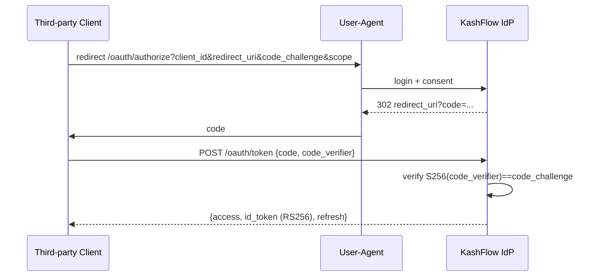
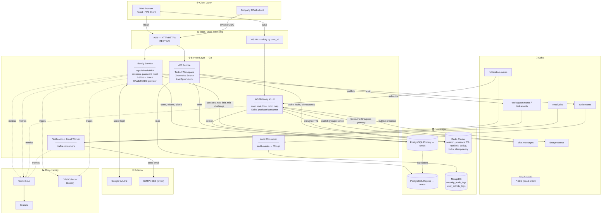
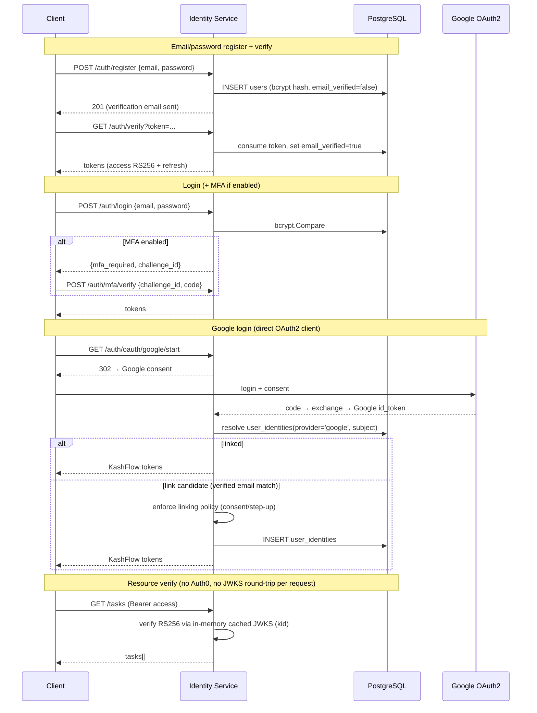
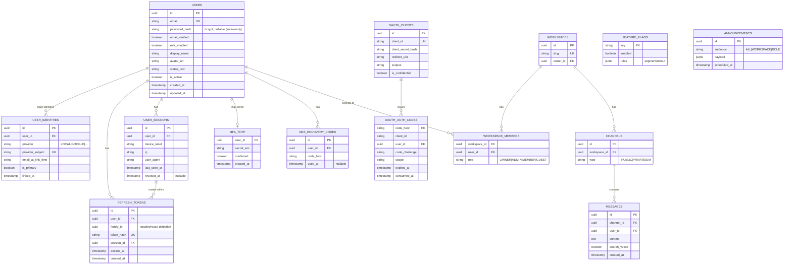

# System Architecture — KashFlow
> Version: 2.0 | Date: 2026-06-20 | Scale target: 1M concurrent users
> Positioning: **Secure real-time collaboration platform** — self-hosted identity, event-driven backend, observability, and deployable infrastructure.

---

## PHẦN 0 — CHANGELOG v1.0 → v2.0 (đọc trước)

v2.0 phản ánh quyết định chiến lược: chuyển dự án từ một CRUD/chat app sang một **production-style secure real-time backend platform** để match cả hai nhóm JD (Identity Platform backend + high-traffic/game backend).

| # | Thay đổi | Lý do |
|---|---|---|
| 1 | **Bỏ Auth0 hoàn toàn.** Identity tự host là single source of truth. | Không thể chứng minh kỹ năng OAuth2/OIDC/JWT/MFA nếu Auth0 làm hết. JD Identity Platform yêu cầu *tự sở hữu* mọi flow. |
| 2 | **Access/ID token chuyển HS256 → RS256 + JWKS.** | Resource server verify bằng public key, không cần shared secret. Thống nhất với OIDC provider. JWKS là skill cả hai JD liệt kê. |
| 3 | **Thêm OAuth2/OIDC Provider** (authorize/token, PKCE, ID token, client registration, scope, consent). | Bằng chứng cụ thể về Identity Platform. |
| 4 | **Google login** giờ là OAuth2 client trực tiếp (KashFlow → Google), không qua Auth0. | Hệ quả của (1). |
| 5 | **Thêm datastore MongoDB** cho audit/activity log (append-heavy). | JD yêu cầu MongoDB schema/index/perf. Bounded scope, không rewrite app. |
| 6 | **Thêm Observability stack**: structured logging (`slog`/`zap`), Prometheus, Grafana, OpenTelemetry tracing. | Production readiness: reliability, debugging, incident response. |
| 7 | **Thêm LiveOps module**: announcement, feature flag, segmented broadcast, scheduled campaign. | Bridge sang game backend (live ops, traffic spike, segmentation). |
| 8 | **Security hardening baseline** + `threat-model.md` + `security-checklist.md`. | OWASP, secure coding expectations. |
| 9 | **Deployment**: full docker-compose, `/healthz` + `/readyz`, CI/CD, K8s/Helm, Terraform skeleton. | Cả hai JD kỳ vọng Docker/CI/CD/deploy thực tế. |

> **Risk priority đảo thứ tự**: trong v1.0 rủi ro lớn nhất là WebSocket in-memory broadcast. Trong v2.0 nó vẫn còn đó (PHẦN 2), nhưng **net-new risk lớn nhất là tự host identity** — giờ bạn sở hữu token security, key rotation, MFA và session revocation. Sai một trong số đó = account takeover. Xem PHẦN 1.

---

## PHẦN 0.5 — RELEASE PLAN (deployable phases)

> Mục tiêu của **Milestone 1**: deploy được một slice **login + tạo workspace** (CHƯA cần chat), nhưng phải đủ chiều sâu kỹ thuật để làm trung tâm CV. Đây là lý do thứ tự là ROI-first chứ không phải feature-completeness.

### 🎯 Milestone 1 — "Deployable Secure Identity + Workspace" (CV centerpiece)

**User story đạt được**: một người dùng register → verify email → bật MFA → login → quản lý session/device → tạo & quản lý workspace → mời thành viên → phân quyền RBAC. Toàn bộ chạy trên hạ tầng deploy thật, có observability.

| Có trong Milestone 1 | Vì sao | CV value |
|---|---|---|
| Self-hosted identity: RS256+JWKS, refresh rotation + reuse detection, sessions/devices, MFA (TOTP), password reset, login rate limit | Đây là "ngôi sao" CV cho Identity Platform role | ⭐⭐⭐ |
| Workspace + members + invitations + RBAC (harden code đã có) | Là phần "create workspace" của user story | ⭐⭐ |
| Redis production patterns: login rate limit, session cache, cache-aside (user/membership), distributed lock, idempotency | Biến Redis từ checkbox thành kinh nghiệm thật | ⭐⭐ |
| MongoDB audit log (write trực tiếp ở M1, chưa qua Kafka) | Mongo schema/index/perf; điều tra sự cố security | ⭐⭐ |
| Observability: structured logs, Prometheus, Grafana, OTel (HTTP/DB/Redis) | "Deployable/production-ready" cần cái này | ⭐⭐ |
| Deployment: full docker-compose, `/healthz`+`/readyz`, GitHub Actions CI, Dockerfile, K8s/Helm deploy | Để thực sự *deploy* + CV bullet Docker/CI/CD/K8s | ⭐⭐⭐ |
| Security hardening baseline + `security-checklist.md` + `threat-model.md` | OWASP/secure coding expectations | ⭐⭐ |

**Hoãn sang Milestone 2+** (không cần cho login+workspace, hoặc cần Kafka/WS):
- EPIC 2 Real-time chat + WebSocket scale + Kafka fan-out.
- EPIC 3 Task management, EPIC 4 Search, EPIC 7 real-time notifications.
- OAuth2/OIDC **Provider** (P2) — CV-mạnh nhưng lớn; xếp đầu Milestone 2.
- LiveOps (cần WS fan-out), E2EE.
- Kafka pipeline — **chỉ stand up khi chat đến** (M1 ghi audit thẳng vào Mongo để giảm số moving part khi deploy lần đầu).

> **Quyết định kiến trúc M1**: KHÔNG dựng Kafka ở Milestone 1. Audit ghi trực tiếp Mongo qua một `AuditWriter` interface. Khi Milestone 2 thêm chat + Kafka, chỉ cần đổi implementation của `AuditWriter` sang publish `audit.events` — service layer không đổi. Đây là lý do interface boundary quan trọng.

### Milestone 2 — Real-time core
Chat + WebSocket sharded rooms + Kafka fan-out + DLQ + presence + notifications. Audit chuyển sang Kafka. Đây là lúc rủi ro #2 (PHẦN 1) được giải quyết.

### Milestone 3 — Platform breadth
OAuth2/OIDC provider, task management, search, LiveOps, load test 1M, Terraform/EKS, (optional) E2EE.

---

## PHẦN 1 — PHÂN TÍCH RỦI RO LỚN NHẤT

### Rủi ro #1 (NET-NEW): Tự host identity = tự gánh toàn bộ attack surface của một IdP

Khi còn Auth0, các lỗ hổng nghiêm trọng nhất (signing key leak, token forgery, refresh replay, brute force) là vấn đề của Auth0. Sau khi bỏ Auth0, **chúng là của bạn**. Các điểm dễ sai và hậu quả:

| Điểm dễ sai | Hậu quả nếu sai | Mitigation bắt buộc |
|---|---|---|
| Refresh token không có reuse detection | Token bị đánh cắp dùng lại vô thời hạn → account takeover | Rotation + **token family**: khi một refresh đã-rotate được dùng lại → revoke cả family |
| RS256 private key quản lý sai (1 key, không rotation) | Lộ key = forge mọi token, không thể xoay vòng an toàn | 2-key overlap theo `kid`, JWKS publish cả hai trong cửa sổ rotation |
| Access token sống quá lâu | Không revoke được trước khi hết hạn | Access ≤ 15 phút; revocation thật nằm ở refresh + session layer |
| MFA bypass (verify sai thứ tự) | MFA thành trang trí | MFA challenge phải nằm **giữa** password-ok và token-issue, không sau |
| Login không rate limit | Credential stuffing / brute force | Sliding window per (email, IP) + lockout, fail-closed |
| Audit log thiếu hoặc sửa được | Không điều tra được sự cố | Append-only (Mongo), không update/delete path từ app |

> Đây là lý do EPIC 10 (Identity hardening) được ưu tiên cao nhất trong thứ tự ROI-first: nó vừa là CV-impact lớn nhất, vừa là rủi ro bảo mật lớn nhất.

### Rủi ro #2: `BroadcastToRoom` là in-memory — hệ thống KHÔNG thể scale ngang

Vẫn nguyên giá trị từ v1.0. Rủi ro này ẩn trong code hiện tại và chỉ lộ khi deploy > 1 instance.

```
chat_service.go → BroadcastToRoom(channelID, msg)
                       ↓
               In-memory room map  [channelID] → [conn1, conn2, conn3]
```

1 instance: chạy tốt. 2+ WS instances (bắt buộc để đạt 1M):

```
Client A → WS Server #1 (room map: [conn_A])
Client B → WS Server #2 (room map: [conn_B])

Client A gửi tin nhắn →
  WS Server #1 broadcast → chỉ Client A nhận được
  WS Server #2 KHÔNG biết → Client B KHÔNG nhận được
```

**2 vấn đề kỹ thuật đi kèm** (vẫn còn trong code):

| Vấn đề | Vị trí | Hậu quả |
|---|---|---|
| `sarama.SyncProducer` | `pkg/kafka/kafka.go` | Block goroutine mỗi lần publish → bottleneck ở high load |
| `sarama.Consumer` thay vì `ConsumerGroup` | `pkg/kafka/kafka.go` | Partitions không chia đều giữa các WS instances → một instance ôm hết |

Mitigation: PHẦN 4 (Diagram 2) + EPIC 4/EPIC 2 trong task-breakdown.

---

## PHẦN 2 — IDENTITY PLATFORM (self-hosted)

> Đây là phần định nghĩa lại linh hồn dự án. Trước đây identity là "Auth0 lo". Giờ KashFlow **là** identity provider.

### 2.1 Token model

| Token | Loại | Signing | TTL | Lưu ở đâu | Mục đích |
|---|---|---|---|---|---|
| Access token | JWT | **RS256** | 15 phút | Không lưu server-side | Authorize request tới resource server (verify bằng JWKS) |
| Refresh token | Opaque random (32B) | — (sha256 hash at rest) | 7–30 ngày | `refresh_tokens` (hash) | Đổi lấy access token mới; rotation + reuse detection |
| ID token (OIDC) | JWT | RS256 | 15 phút | Không lưu | Trả về cho OAuth2/OIDC client mô tả danh tính user |

**Nguyên tắc**:
- Access token **không** revoke trực tiếp (stateless verify). Muốn "đá" user → revoke refresh + session; access tự chết trong ≤15 phút.
- Refresh token **không bao giờ** lưu plaintext. Server lưu sha256 hash; client giữ bản raw.
- Một lần refresh = rotation: refresh cũ bị xóa, cấp cặp mới. Refresh cũ bị dùng lại lần 2 → đó là dấu hiệu token bị trộm → **revoke cả token family**.

### 2.2 RS256 + JWKS key management

```
/.well-known/jwks.json   →  { "keys": [ {kid, kty:RSA, use:sig, n, e}, ... ] }
/.well-known/openid-configuration  (OIDC discovery)
```

- Mỗi signing key có `kid`. Access/ID token header mang `kid` → verifier biết dùng key nào.
- **Rotation 2-key overlap**: khi xoay key, publish cả key cũ + key mới trong JWKS một cửa sổ (≥ access TTL × 2). Token cũ vẫn verify được tới khi hết hạn, rồi mới remove key cũ.
- Private key đọc từ secret store (env/secret manager), **không** commit, **không** log.

### 2.3 Session / device management

```
user_sessions: id, user_id, refresh_token_family_id, device_label,
               ip, user_agent, created_at, last_seen_at, revoked_at
```

- Mỗi lần login tạo 1 session + 1 refresh family.
- API: `GET /me/sessions` (list active), `DELETE /me/sessions/:id` (logout 1 device), `DELETE /me/sessions` (logout all).
- Revoke session → revoke refresh family → các access token gắn session đó hết hiệu lực sau khi hết TTL.

### 2.4 MFA

- **TOTP** (RFC 6238) là chính: enroll → server sinh secret → user quét QR → verify code để bật. Recovery codes (one-time, hashed) cho trường hợp mất thiết bị.
- **Email OTP** là fallback.
- Vị trí trong flow (quan trọng): `password OK` → **`MFA challenge`** → `issue tokens`. MFA không được nằm sau token issue.
- Audit: `MFA_ENABLED`, `MFA_DISABLED`, `MFA_FAILURE`.

### 2.5 Các flow nhạy cảm khác

| Flow | Cơ chế | Chống lạm dụng |
|---|---|---|
| Password reset | Token random hashed, TTL ngắn, one-time | Rate limit per email; không tiết lộ email có tồn tại hay không |
| Email verification | (đã có) token hashed, TTL 24h | Cooldown resend 1 phút (đã có) |
| Login | bcrypt compare | Sliding-window rate limit per (email, IP) + lockout |
| Logout | Xóa refresh (đã có) | — |

### 2.6 Audit log (mọi sự kiện identity)

Ghi vào MongoDB (PHẦN 7): `LOGIN_SUCCESS`, `LOGIN_FAILURE`, `LOGOUT`, `TOKEN_REFRESH`, `REFRESH_REUSE_DETECTED`, `MFA_ENABLED/DISABLED/FAILURE`, `PASSWORD_RESET_REQUESTED/COMPLETED`, `SESSION_REVOKED`.

### Diagram — Token lifecycle (self-hosted)

```mermaid
sequenceDiagram
    participant C as Client
    participant ID as Identity Service
    participant DB as PostgreSQL
    participant M as MongoDB (audit)
    participant RS as Resource Server (API)

    Note over C,RS: Login (password + MFA)
    C->>ID: POST /auth/login {email, password}
    ID->>DB: SELECT user; bcrypt.Compare
    alt MFA enabled
        ID-->>C: 200 {mfa_required, challenge_id}
        C->>ID: POST /auth/mfa/verify {challenge_id, totp}
    end
    ID->>DB: create session + refresh family (hash)
    ID->>M: audit LOGIN_SUCCESS
    ID-->>C: {access (RS256, 15m), refresh (opaque)}

    Note over C,RS: Authorized request
    C->>RS: GET /tasks (Bearer access)
    RS->>RS: verify RS256 via cached JWKS (kid)
    RS-->>C: 200 tasks[]

    Note over C,RS: Refresh rotation + reuse detection
    C->>ID: POST /auth/refresh {refresh}
    ID->>DB: lookup hash; if already-rotated → revoke family + audit REFRESH_REUSE_DETECTED
    ID->>DB: rotate (delete old, issue new)
    ID-->>C: {access, refresh'}
```

---

## PHẦN 3 — OAuth2 / OIDC PROVIDER (learning prototype, production-shaped)

> Module IdP nội bộ để vừa học vừa demo. Dùng chung key/JWKS với PHẦN 2.

### Endpoints

```
GET  /oauth/authorize          Authorization Code + PKCE (S256)
POST /oauth/token              code→token, refresh→token, (client_credentials optional)
GET  /.well-known/jwks.json    (shared với identity)
GET  /.well-known/openid-configuration
GET  /userinfo                 OIDC userinfo (Bearer access)
POST /oauth/clients            client registration (admin)
```

### Data model

```
oauth_clients:              id, client_id, client_secret_hash, redirect_uris[],
                            grant_types[], scopes[], is_confidential, created_at
oauth_authorization_codes:  code_hash, client_id, user_id, redirect_uri,
                            code_challenge, scope, expires_at, consumed_at
oauth_consents:             user_id, client_id, scopes[], granted_at
```

### Authorization Code + PKCE (S256)



### Google login (reframed)

Sau khi bỏ Auth0, KashFlow là **OAuth2 client của Google** trực tiếp:
`/auth/oauth/google/start` → Google consent → `/auth/oauth/google/callback` → verify Google ID token → resolve/link `user_identities(provider='google')` → issue KashFlow tokens. Account linking policy (PHẦN 4.4) giữ nguyên.

---

## PHẦN 4 — SYSTEM ARCHITECTURE DIAGRAMS

### Diagram 1: Tổng quan hệ thống (System Overview) — v2.0



### Diagram 2: WebSocket Message Fan-out Flow (Critical Path) — giữ nguyên từ v1.0

> Luồng quan trọng nhất — cách 1M users nhận message cùng lúc. Không đổi vì thiết kế Kafka fan-out vẫn đúng.

```mermaid
sequenceDiagram
    participant CA as Client A
    participant WS1 as WS Gateway #1
    participant PG as PostgreSQL
    participant KF as Kafka (chat.messages)
    participant WS2 as WS Gateway #2
    participant WS3 as WS Gateway #3
    participant CB as Client B (on WS2)
    participant CC as Client C (on WS3)

    Note over CA,CC: Client A gửi message vào channel "general"
    CA->>WS1: WS frame: {channel_id, content}
    par Persist & Publish (parallel)
        WS1->>PG: INSERT INTO messages (async write)
        WS1->>KF: AsyncProducer.Input() <- msg (key = channel_id, no blocking)
    end
    Note over KF: Kafka phân phối đến tất cả ConsumerGroup "ws-gateway"
    par Fan-out to all WS servers
        KF->>WS1: ConsumerGroup receives msg
        KF->>WS2: ConsumerGroup receives msg
        KF->>WS3: ConsumerGroup receives msg
    end
    Note over WS1: local map: general → [conn_A]; deliver (echo)
    WS1-->>CA: Delivered ✓ (server timestamp + msg_id)
    Note over WS2: local map: general → [conn_B]
    WS2-->>CB: Delivered ✓
    Note over WS3: local map: general → [conn_C]
    WS3-->>CC: Delivered ✓
```

### Diagram 3: Authentication Flow — REWRITTEN (self-hosted, Auth0 removed)



### Diagram 4: Data Schema — v2.0 (identity-platform ready)

> App DB **giờ lưu** `password_hash`, `email_verified`, MFA secret, refresh tokens, OAuth clients. Auth0 không còn là nguồn identity.



> **Audit / activity logs KHÔNG nằm ở Postgres** — chúng append-heavy và đi vào MongoDB (PHẦN 7).

### Linking Policy (giữ từ v1.0, vẫn bắt buộc)

1. Không auto-link nếu `email_verified = false`.
2. Không link chỉ dựa vào email; cần explicit consent hoặc step-up auth.
3. `provider_subject` duy nhất toàn hệ thống.
4. Mỗi login resolve theo `provider_subject` trước, fallback email chỉ khi chưa có identity row.
5. Sau khi link, mọi provider của user map về cùng `users.id`.

---

## PHẦN 5 — REDIS KEY DESIGN (v2.0, mở rộng)

| Key Pattern | Value | TTL | Mục đích |
|---|---|---|---|
| `presence:{user_id}` | `1` | 30s | Online/offline (heartbeat refresh) |
| `ratelimit:{scope}:{id}` | counter | 1 phút | Sliding window API rate limit (per user / per IP) |
| `login:fail:{email}:{ip}` | counter | 15 phút | Brute-force / lockout cho login |
| `mfa:challenge:{id}` | `{user_id, expires}` | 5 phút | MFA challenge giữa password-ok và token-issue |
| `session:{session_id}` | session meta | = refresh TTL | Hot read cho session validation |
| `dedup:{message_id}` | `1` | 5 phút | Kafka at-least-once dedup |
| `idem:{key}` | result/`1` | tùy action | **Idempotency key** cho sensitive POST (resend email, invite resend, broadcast) |
| `lock:{resource}` | token | vài giây | **Distributed lock** (resend email, invitation resend, scheduled job leader) |
| `cache:user:{id}` | user JSON | 5–10 phút | Cache-aside profile; chống stampede bằng `singleflight` (in-proc) + lock (cross-proc) |
| `cache:wsmember:{ws}:{user}` | role | 5 phút | Cache workspace membership/permission; **invalidate khi role/member đổi** |
| `channel:unread:{user}:{channel}` | count | none | Unread counter |

**TTL strategy**: hot-and-cheap-to-recompute → TTL ngắn (presence 30s). Expensive-and-stable → TTL dài + explicit invalidation (permission cache 5 phút + invalidate on change). Security counters → TTL = window.

**Cache stampede protection**: với key nóng (profile của user active), khi cache miss nhiều goroutine cùng query DB → dùng `golang.org/x/sync/singleflight` trong process + Redis `lock:` cross-process để chỉ một caller rebuild.

---

## PHẦN 6 — KAFKA TOPIC DESIGN (v2.0, mở rộng + DLQ)

| Topic | Partition Key | Retention | Consumer Groups |
|---|---|---|---|
| `chat.messages` | `channel_id` | 7 ngày | `ws-gateway` (all WS instances) |
| `chat.presence` | `user_id` | 1 phút | `ws-gateway` |
| `notification.events` | `user_id` | 24 giờ | `ws-gateway`, `notification-service` |
| `workspace.events` / `task.events` | `workspace_id` | 7 ngày | `notification-service`, `audit-consumer` |
| `audit.events` | `user_id` | 30 ngày | `audit-consumer` (→ MongoDB) |
| `email.jobs` | `user_id` | 3 ngày | `email-worker` |
| `*.DLQ` | source key | 14 ngày | manual replay tool |

**Reliability patterns (EPIC 4)**:
- **Idempotency key** trên mỗi event (`event_id`); consumer dedup qua Redis `dedup:` trước khi side-effect.
- **Retry with backoff** ở consumer; sau N lần fail → publish sang `*.DLQ` kèm lý do.
- **Consumer groups** để chia partition giữa instances; commit offset sau khi xử lý thành công (at-least-once).
- Partition by `channel_id` cho `chat.messages` để giữ FIFO ordering trong channel; bắt đầu 32 partitions.

---

## PHẦN 7 — MONGODB AUDIT / ACTIVITY MODULE (NET-NEW)

> Vì sao Mongo chứ không Postgres: log là **append-heavy, schema linh hoạt (metadata jsonb), ít join, query theo time-range + user**. Đây là cách thêm MongoDB *bounded* (chỉ logging) mà không rewrite app — đúng yêu cầu JD về Mongo schema/index/perf.

### Collections

```
security_audit_logs:  { _id, user_id, event_type, ip_address, user_agent,
                        metadata, created_at }
user_activity_logs:   { _id, user_id, workspace_id, action, target, metadata, created_at }
```

### Indexes

```
{ user_id: 1, created_at: -1 }       // "all events of a user, newest first"
{ event_type: 1, created_at: -1 }    // "all LOGIN_FAILURE in window"
{ created_at: 1 } TTL (optional)     // retention nếu cần auto-expire
```

### Write path
`audit.events` (Kafka) → `audit-consumer` → insert Mongo. App **không** có update/delete path → append-only đúng nghĩa.

### Read API
`GET /admin/audit?user_id&event_type&from&to&cursor` — cursor pagination (theo `created_at,_id`), index-backed, không seq scan.

---

## PHẦN 8 — OBSERVABILITY (NET-NEW)

### Structured logging
- `slog` (hoặc `zap`) JSON logs. Mỗi log có `trace_id`, `user_id` (nếu có), `request_id`. Không log secret/token/password.

### Metrics (Prometheus, `/metrics`)
| Metric | Type | Vì sao |
|---|---|---|
| `http_requests_total{route,method,status}` | counter | traffic + error rate |
| `http_request_duration_seconds` | histogram | p50/p95/p99 latency |
| `ws_active_connections` | gauge | capacity planning, leak detection |
| `kafka_consumer_lag` | gauge | event pipeline health |
| `redis_op_errors_total` | counter | cache reliability |
| `db_query_duration_seconds` | histogram | DB hot paths |
| `auth_login_failures_total` | counter | brute-force signal |

### Tracing (OpenTelemetry)
Span chain: HTTP handler → service method → DB call → Redis call → Kafka publish/consume. Propagate `trace_id` qua context và qua Kafka headers để trace cross-service.

### Dashboards & alerts (Grafana)
- Dashboard: request rate/latency, WS connections, Kafka lag, DB latency, login failures.
- Alert ví dụ: p95 > 300ms; error rate > 1%; `kafka_consumer_lag` > threshold; login failures spike.

---

## PHẦN 9 — SECURITY HARDENING BASELINE (NET-NEW)

> Chi tiết: `docs/security-checklist.md` + `docs/threat-model.md`.

| Hạng mục | Quy tắc |
|---|---|
| Body size | `http.MaxBytesReader` ≤ 1MB trước `ShouldBindJSON` (đã là rule trong AGENTS.md) |
| CORS | Allowlist từ `ALLOWED_ORIGINS`, không `*` ở prod |
| WS origin | Validate origin trước upgrade |
| Password | bcrypt (đã có); cân nhắc cost theo hardware |
| CSRF | Nếu dùng cookie cho refresh → SameSite + CSRF token |
| SQL | Parameterized only (GORM `?`); reject string concat |
| Error | Không trả raw `err.Error()` ra client (đã là rule) |
| Headers | `X-Content-Type-Options`, `X-Frame-Options`, `Referrer-Policy`, HSTS (prod) |
| Brute force | Login rate limit + lockout (PHẦN 2.5) |
| Secrets | RS256 private key + JWT/SMTP creds từ secret store, không log |
| Audit | Mọi sensitive action ghi audit (PHẦN 2.6 / PHẦN 7) |

---

## PHẦN 10 — LIVEOPS MODULE (NET-NEW)

> Bridge sang game-backend JD: live operations, traffic spike, segmentation, real-time user-facing comms.

- **Announcements**: admin tạo → broadcast tới audience (ALL / workspace / role-based segment). Delivery qua `notification.events` → WS fan-out, **rate-limited** để tránh fan-out storm.
- **Feature flags**: `GET /flags` trả config theo segment/rollout %; lưu `feature_flags` + cache Redis.
- **Scheduled campaigns**: `scheduled_at`; một leader (Redis lock) phát đúng giờ, idempotent.
- **Segments**: active users (presence), workspace members, role-based audience.

---

## PHẦN 11 — INFRASTRUCTURE (Local → AWS → K8s/Terraform)

### Local Development (docker-compose, v2.0)
```
docker-compose.yaml
├── identity + api (go)   (8080)
├── postgres              (5432)
├── redis                 (6379)
├── kafka + zookeeper     (9092 / 2181)
├── mongodb               (27017)
├── mailhog               (1025 / 8025)   SMTP mock
├── prometheus            (9090)
└── grafana               (3000)
```
Health: `/healthz` (process alive), `/readyz` (DB/Redis/Kafka/Mongo ready).

### AWS Production Target
```
AWS VPC (private subnets)
├── ECS Fargate: identity, api, ws-gateway (N), notification, audit-consumer
├── RDS PostgreSQL (primary + read replica)
├── ElastiCache Redis (cluster mode)
├── MSK (Managed Kafka, 3 brokers)
├── DocumentDB / MongoDB Atlas (audit)
├── Secrets Manager (RS256 key, DB/SMTP creds)
└── ALB (HTTP + WebSocket listeners)
```

### Kubernetes / Helm / Terraform (EPIC 16)
- K8s: Deployment, Service, Ingress, ConfigMap, Secret, liveness/readiness probes (→ `/healthz` + `/readyz`), resource requests/limits, HPA (scale ws-gateway theo CPU/conn).
- Terraform skeleton: VPC, ECS/EKS, RDS, ElastiCache, MSK/SQS optional.
- CI/CD: GitHub Actions test → build → image → (staging) deploy.

---

## PHẦN 12 — TECHNICAL DEBT / ĐIỂM CẦN LÀM (v2.0, cập nhật)

> Sắp theo thứ tự xử lý gợi ý (ROI-first). ✅ = đã xong.

| # | Vấn đề | File / Vùng | Fix cần làm |
|---|---|---|---|
| 1 | **Auth0 còn song song với local auth** | `middleware/auth.go`, `config` | Gỡ Auth0 path; identity tự host là single source of truth |
| 2 | **Access token HS256** | `local_auth_service.go:issueTokenPair` | Chuyển RS256 + JWKS endpoint + key rotation (`kid`) |
| 3 | Refresh chưa có reuse detection | `local_auth_service.go:Refresh` | Token family + revoke-on-reuse |
| 4 | Chưa có MFA / session management / password reset | identity service | EPIC 10 |
| 5 | `SyncProducer` block goroutine | `pkg/kafka/kafka.go` | `AsyncProducer` |
| 6 | `sarama.Consumer` thay vì `ConsumerGroup` | `pkg/kafka/kafka.go` | `NewConsumerGroup` (group `ws-gateway`) |
| 7 | `BroadcastToRoom` in-memory | `chat_service.go` | Route qua Kafka fan-out (Diagram 2) |
| 8 | Audit/observability chưa wired | toàn hệ | EPIC 11/12/13 |
| 9 | Redis caching `cache:user`, permission cache chưa có | `middleware`, services | PHẦN 5 |
| 10 | ✅ DB connection pool config | `config.go` | Đã set `DBMaxOpenConns/IdleConns/ConnMaxLifetime` |
| 11 | ✅ Account linking model | `user_identities` + consent | Đã implement |
| 12 | ✅ Workspace/channel concept tách khỏi task | migration 002 | Đã implement |

> Khi fix #1/#2, cập nhật `AGENTS.md` (stack table + auth rules) cho khớp — file đó đang governing mọi code review.
