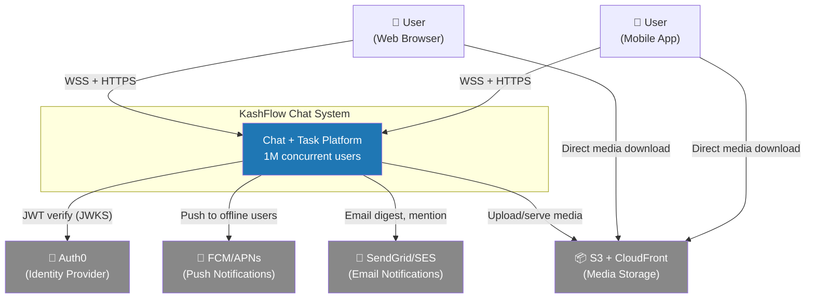
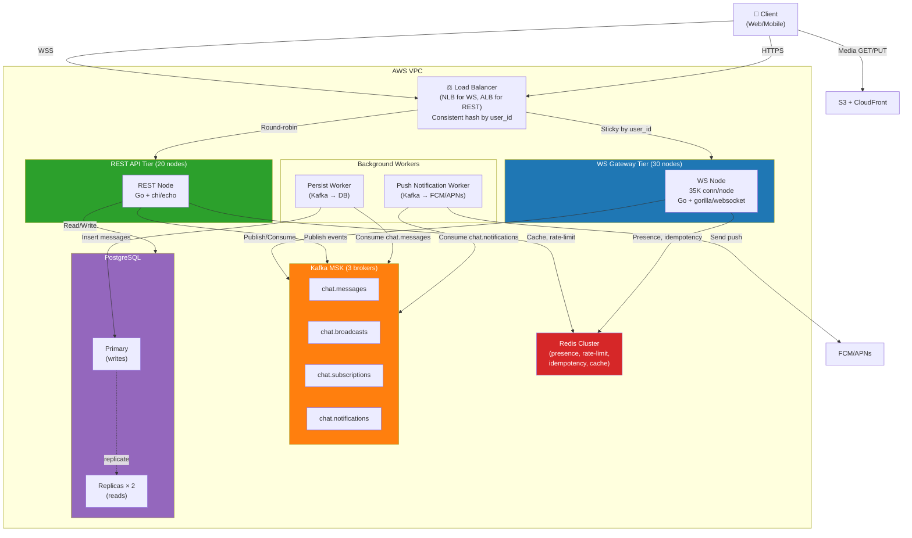
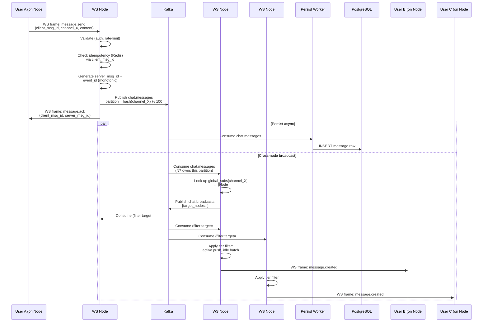
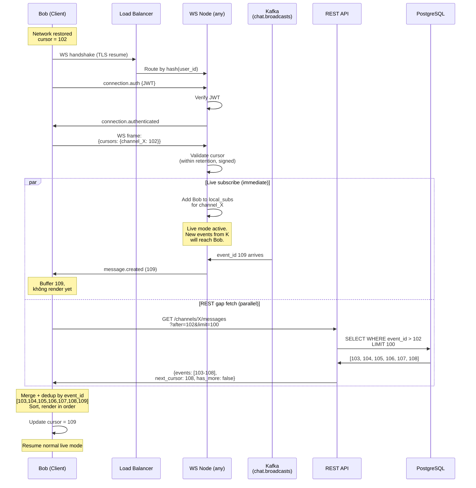
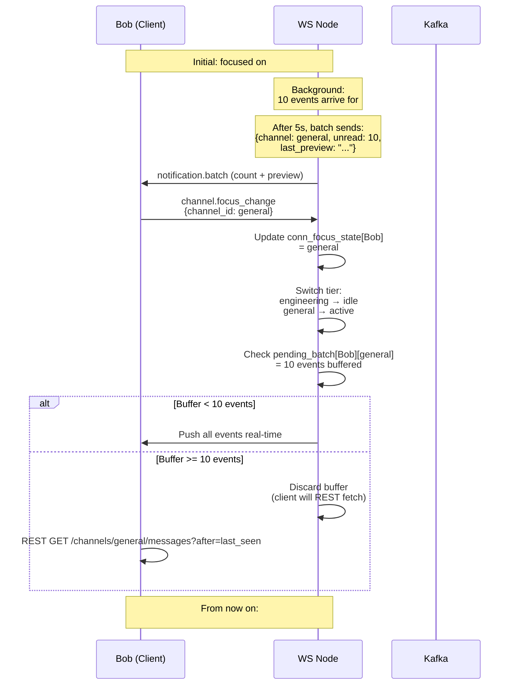
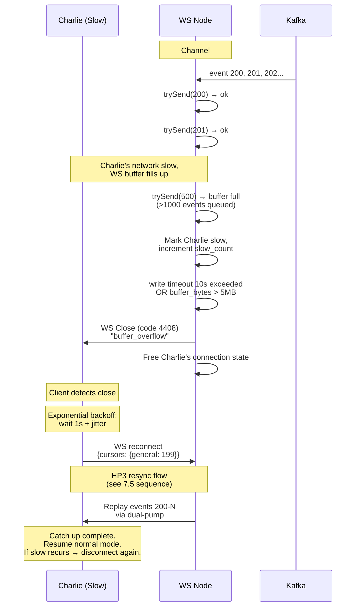
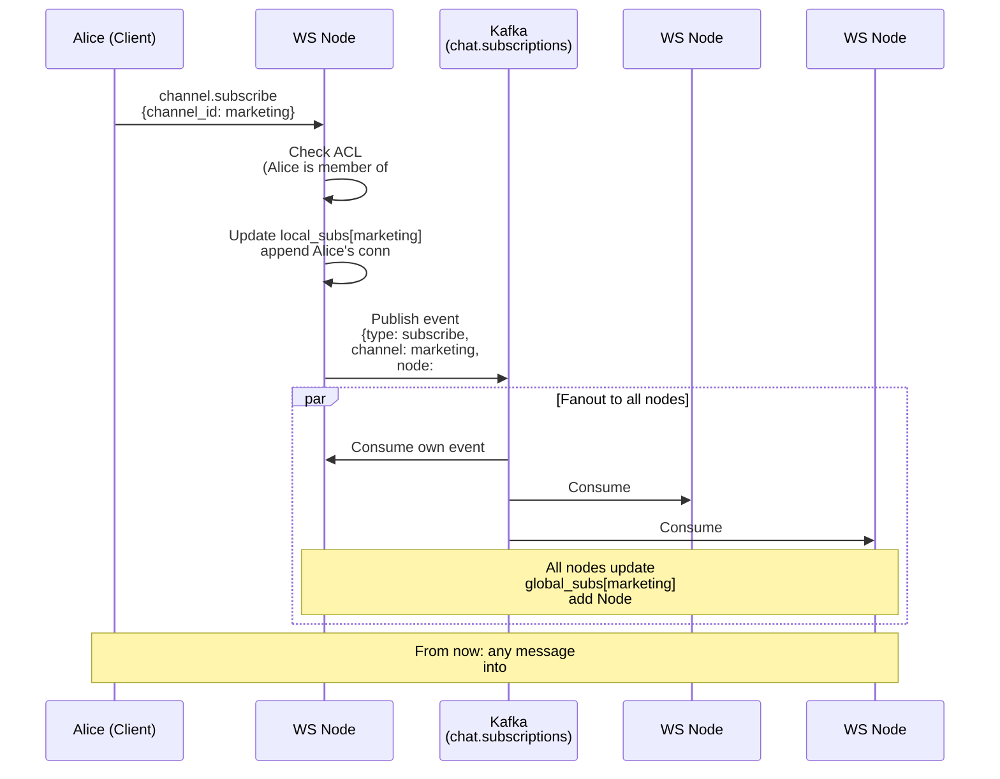

# Chat System Design — T09 (WebSocket Architecture)

> Sprint: 3 | Task: T09 (Design WebSocket architecture) | Status: ✅ COMPLETE — ready for T10 implementation
> Scale target: 1M concurrent users | Stack: Go + PostgreSQL + Kafka + Redis

---

## Design Process — 7-Step Framework

| Step | Topic | Status |
|---|---|---|
| 1 | Functional Requirements (events catalog) | ✅ Done |
| 2 | Non-functional Requirements + Scale Estimation | ✅ Done |
| 3 | Constraints & Assumptions | ✅ Done |
| 4 | Identify Hard Parts | ✅ Done |
| 5 | Design Options + Tradeoffs | ✅ Done |
| 6 | Failure Modes | ✅ Done |
| 7 | Diagrams + Final Doc | ✅ Done |

---

## Step 1 — Functional Requirements

### 1.1 Decision Criteria

Áp dụng nhất quán cho mọi event trong hệ thống:

1. **Pattern A (WebSocket)** dùng cho:
   - Hot-path messages (send, react, typing) — latency-critical
   - Connection lifecycle (auth, ping, error) — buộc qua WS theo định nghĩa
   - Real-time S→C broadcasts — raison d'être của WS

2. **REST** dùng cho:
   - Rare/idempotent CRUD (`message.edit`, `message.delete`)
   - Business resources có authorization phức tạp (channel CRUD, task CRUD)
   - Bulk fetches (message history, search, member list pagination)

3. **S→C events LUÔN qua WS**, kể cả khi command đi REST.
   → REST trả 200 OK cho caller; broadcast cho các subscribers KHÁC qua WS.

4. **Naming convention:**
   - C→S commands: imperative — `message.send`, `reaction.add`
   - S→C events: past-tense — `message.created`, `reaction.added`

---

### 1.2 Table A — WebSocket Protocol Events

#### A.1 Connection Lifecycle (5 events)

| # | Event | Dir | Freq | Note |
|---|---|---|---|---|
| 1 | `connection.auth` | C→S | once/connection | First frame sau WS handshake, gửi JWT. Server verify (T02 RS256 + JWKS). Fail → close với code 4401 |
| 2 | `connection.authenticated` | S→C | once | Confirm + trả `session_id`, `server_time` (cho clock skew). Hoặc close 4401 |
| 3 | `connection.ping` | C→S | 0.05 (~20s) | App-level heartbeat (không dùng WS RFC ping vì cần passing data: `last_seen_msg_id`) |
| 4 | `connection.pong` | S→C | 0.05 | Reply ping. Server detect disconnect khi miss 2-3 pings (40-60s) |
| 5 | `connection.error` | S→C | rare | Server push: rate limit, session expired, server overload. Client decide retry/relogin |

#### A.2 Message Hot-Path (3 events) — Pattern A pure

| # | Event | Dir | Freq | Note |
|---|---|---|---|---|
| 6 | `message.send` | C→S | 0.05 | Payload: `{ client_msg_id, channel_id, content, parent_id?, reply_to? }`. `client_msg_id` = idempotency key |
| 7 | `message.ack` | S→C | 0.05 | Map `client_msg_id` → `server_msg_id`. Client unbuffer pending message. Critical cho retry logic |
| 8 | `message.created` | S→C | 0.5 peak | Broadcast tới subscribers của channel |

#### A.3 Message CRUD broadcasts (2 events)

> Commands `PATCH /messages/:id`, `DELETE /messages/:id` đi REST (xem Table B).

| # | Event | Dir | Freq | Note |
|---|---|---|---|---|
| 9 | `message.updated` | S→C | 0.01 | Broadcast khi edit. Payload: `{ msg_id, new_content, edited_at, version }` |
| 10 | `message.deleted` | S→C | 0.005 | Broadcast khi delete. Tránh ghost message |

#### A.4 Reactions (4 events) — Pattern A

| # | Event | Dir | Freq | Note |
|---|---|---|---|---|
| 11 | `reaction.add` | C→S | 0.05 | Hot-path, latency thấp cho UX |
| 12 | `reaction.remove` | C→S | 0.02 | Same |
| 13 | `reaction.added` | S→C | 0.1 peak | Broadcast |
| 14 | `reaction.removed` | S→C | 0.05 | Broadcast |

#### A.5 Typing (2 events) — fire-and-forget

| # | Event | Dir | Freq | Note |
|---|---|---|---|---|
| 15 | `typing.start` | C→S | 0.2 burst | Client debounce 1-2s. Server auto-clear sau 5s không nhận thêm → không cần `typing.stop` |
| 16 | `typing.updated` | S→C | 0.2 peak | Broadcast: `{ user_id, channel_id, typing: bool, expires_at }` |

#### A.6 Read Receipts (2 events) — batched

| # | Event | Dir | Freq | Note |
|---|---|---|---|---|
| 17 | `message.read` | C→S | 0.02 | Cursor-based: `{ channel_id, last_read_msg_id }`. Batch theo time hoặc khi user idle, không gửi mỗi message (T20) |
| 18 | `message.read_by` | S→C | 0.05 | Broadcast: `{ user_id, channel_id, last_read_msg_id }`. Trong group lớn, fan-out nặng → cân nhắc throttle |

#### A.7 Channel Subscription (4 events) — WS-level subscription

> Subscription = "tôi muốn nhận events của channel này" (WS state).
> Khác với membership = ACL state (DB). Phải tách rõ — sẽ chi tiết ở Step 4 (room routing).

| # | Event | Dir | Freq | Note |
|---|---|---|---|---|
| 19 | `channel.subscribe` | C→S | 0.01 | Bắt đầu nhận broadcasts. Server check ACL trước khi add subscriber |
| 20 | `channel.unsubscribe` | C→S | 0.01 | Stop nhận. Khi user đóng tab/đổi channel |
| 21 | `channel.member_joined` | S→C | 0.01 | User mới join channel (membership thay đổi, khác subscription) |
| 22 | `channel.member_left` | S→C | 0.01 | Same |

#### A.8 Channel/Workspace metadata broadcasts (4 events)

| # | Event | Dir | Freq | Note |
|---|---|---|---|---|
| 23 | `channel.created` | S→C | rare | Workspace có channel mới → user trong workspace nhận để update sidebar |
| 24 | `channel.updated` | S→C | rare | Name, topic, settings thay đổi |
| 25 | `channel.deleted` | S→C | rare | Update sidebar, đóng channel nếu user đang mở |
| 26 | `workspace.updated` | S→C | very rare | Workspace settings, member list thay đổi |

#### A.9 Presence (1 event)

| # | Event | Dir | Freq | Note |
|---|---|---|---|---|
| 27 | `presence.updated` | S→C | 0.02 | Broadcast online/away/offline. Subscribed theo workspace hoặc "buddy list". Driven bởi ping timeout (T19/T40) |

#### A.10 Notifications (1 event, unified)

| # | Event | Dir | Freq | Note |
|---|---|---|---|---|
| 28 | `notification.created` | S→C | 0.1 peak | Unified channel cho mọi notification type (mention, task assigned, due soon). Payload có `type` field. T54 sẽ implement consumer |

#### A.11 Task broadcasts (5 events) — REST commands + WS broadcasts

> Task CRUD đi REST (xem Table B). Đây chỉ là S→C broadcasts.

| # | Event | Dir | Freq | Note |
|---|---|---|---|---|
| 29 | `task.assigned` | S→C | 0.005 | Notify assignee (T27) |
| 30 | `task.status_changed` | S→C | 0.05 peak | Sync Kanban board real-time (T31). Fan-out tới subscribers của project/board |
| 31 | `task.updated` | S→C | 0.02 | Field khác (priority, due_date, description) — gộp 1 event với `changed_fields` array để tránh event noise |
| 32 | `task.due_soon` | S→C | 0.01 | Server cron triggered (không từ user action) |
| 33 | `task.comment_created` | S→C | 0.05 | Notify task followers (T29) |

#### A.12 Multi-device sync (2 events)

| # | Event | Dir | Freq | Note |
|---|---|---|---|---|
| 34 | `session.synced` | S→C | 0.005 | Cross-device state: read state, draft sync giữa các device của cùng user |
| 35 | `conversation.synced` | S→C | 0.02 | Sau reconnect: server replay events đã miss kể từ `last_event_id` client gửi (T23) |

---

### 1.3 Table B — Paired REST Endpoints

| Method | Path | Pairs với WS event | Note |
|---|---|---|---|
| `PATCH` | `/messages/:id` | → `message.updated` | Edit rare, idempotent |
| `DELETE` | `/messages/:id` | → `message.deleted` | Rare |
| `GET` | `/channels/:id/messages?cursor=...` | n/a | Bulk fetch, cursor pagination (T17) |
| `POST` | `/channels` | → `channel.created` | Resource creation |
| `PATCH` | `/channels/:id` | → `channel.updated` | Settings update |
| `DELETE` | `/channels/:id` | → `channel.deleted` | |
| `POST` | `/channels/:id/members` | → `channel.member_joined` | Add member (RBAC check) |
| `DELETE` | `/channels/:id/members/:user_id` | → `channel.member_left` | Remove member |
| `POST` | `/tasks` | → `task.created` (notification) | Task creation |
| `PATCH` | `/tasks/:id` | → `task.updated` / `task.assigned` / `task.status_changed` | Routes về event tương ứng theo `changed_fields` |
| `DELETE` | `/tasks/:id` | → `task.deleted` (notification) | |
| `POST` | `/tasks/:id/comments` | → `task.comment_created` | |
| `POST` | `/auth/refresh` | n/a | Token refresh, security tách riêng (không đụng WS) |
| `GET` | `/search?q=...` | n/a | Search REST (T34) |

---

### 1.4 Decisions có chủ ý + Rationale

| Decision | Rationale |
|---|---|
| **Hybrid Pattern (A + REST)** | Pattern A pure đơn giản nhưng REST middleware ecosystem (auth, validation, rate-limit, audit log) trưởng thành hơn cho business CRUD. Industry-standard (Slack/Discord). |
| **`message.send` qua WS, KHÔNG REST** | Hot-path. Latency budget 50-100ms end-to-end. HTTP POST + JWT verify mỗi request mất 20-50ms. WS đã established → chỉ frame send. |
| **`task.update_status` qua REST** | Status change ít hơn message bằng nhiều order of magnitude. REST cho phép strong validation (state machine — T28), audit log dễ. Trade 5-20ms latency = chấp nhận được. |
| **`message.read` batch không per-message** | T20 ghi rõ. Per-message read receipt trong group 100 user = 100 fan-out events / 1 message read = bùng nổ. |
| **`typing.stop` bị loại** | Server-side timeout 5s đơn giản hơn + robust hơn (client crash không gửi stop = bug). Industry standard. |
| **`reaction.*` qua WS dù tần suất "rare"** | Frequency 0.05 không thực sự rare. UX expectation: react thấy ngay. Latency budget 100ms. |
| **`notification.created` unified với `type` field** | Mention, task assign, due soon, system message gộp 1 event. Đỡ event proliferation, client switch theo type. |
| **`channel.subscribe` ≠ `channel.member_joined`** | Subscription = WS state ("muốn nhận broadcasts"). Membership = ACL state (DB). Hai khái niệm phải tách rõ ngay từ đầu — sẽ đào sâu ở Step 4 (room routing). |
| **Auth via `connection.auth` event, không qua URL query param** | URL params bị log trong access log → JWT leak. First-frame auth là pattern an toàn. |

---

### 1.5 Tổng kết Step 1

- **35 WebSocket events** chia 12 nhóm
- **14 REST endpoints** kèm theo
- Decision criteria + rationale articulate xong
- Naming convention cố định

---

## Step 2 — Non-functional Requirements + Scale Estimation

> **Quy tắc**: mọi số phải có derivation chain. Format `metric = input₁ × input₂ × ... = result`.
> Assumption ghi rõ để sau review lại.

### 2.1 Target Scale Metrics

**Architectural target**: hỗ trợ **1,000,000 concurrent connections** ở peak (theo spec T09 + architecture.md).

```
Derivation (top-down từ MAU):

MAU                        = 5,000,000        (assumption baseline)
DAU/MAU ratio              = 50%              (chat/collab benchmark: Slack 50%, Discord 50%, Teams 60%, WhatsApp 70%)
DAU                        = 5M × 0.50        = 2,500,000
Peak concurrent factor     = 40%              (work hour spike: 9-11AM + 2-4PM)
Concurrent users (peak)    = 2.5M × 0.40      = 1,000,000
Multi-device factor        = 1.0              (assume 1 active device/user — phone OR laptop. Multi-device login sync qua S→C event, không multiply connection count)
Concurrent connections     = 1M × 1.0         = 1,000,000  ← architecture target
```

**Connection state breakdown:**

```
Active fraction   = 30%      (typing/reading/scrolling actively)  → 300K active
Idle fraction     = 70%      (logged in, app background/inactive) → 700K idle
```

> **Tại sao tách active/idle quan trọng**: idle connection chỉ tốn RAM (constant), không tốn CPU. Active connection tốn cả RAM + CPU (process events). Sizing CPU dựa trên active count, sizing RAM dựa trên total count.

---

### 2.2 Latency Budget

Per event class. Latency budget = **end-to-end** (client A action → client B nhận event).

#### Hot-path: `message.send` → `message.created` (peer nhận)

```
Target: p50 < 100ms, p99 < 250ms

Breakdown:
  Client A → Server WS frame    : 10-20ms   (network RTT/2 + frame parse)
  Server auth + validate        : 5-10ms    (JWT cached after connection.auth, idempotency check Redis)
  DB write (async, fire+forget) : 0ms       (acked qua kafka, persist async)
  Kafka publish                 : 1-5ms     (async producer, local buffer)
  Cross-node Kafka consume      : 5-20ms    (consumer group lag)
  Server B fan-out + WS frame   : 10-20ms

Sum (median path): 30-75ms  → fits p50 100ms
Sum (tail path):   ~200ms   → fits p99 250ms
```

> **Decision**: DB write KHÔNG nằm trong critical path. Server publish Kafka → ACK ngay. Persistence async (T16). Nếu DB write fail, retry qua Kafka consumer + reconcile. Latency win lớn.

#### Connection establishment (cold start)

```
Target: p50 < 500ms, p99 < 1000ms

Breakdown:
  TLS handshake (1.3 with 0-RTT)    : 50-150ms
  WS upgrade (HTTP 101 + 1 RTT)     : 30-100ms
  connection.auth (JWT verify)      : 10-30ms
  conversation.synced (delta replay): 50-500ms (tùy missed events)
```

#### Reconnect (warm, sau network blip)

```
Target: p50 < 300ms, p99 < 800ms

Branched từ cold:
  TLS resumption (session ticket)   : 1 RTT (~30-50ms)
  WS upgrade + auth                 : ~100ms
  conversation.synced               : variable (10ms nếu 0 events, 500ms+ nếu nhiều)
```

#### Other event classes

| Event class | Target | Lý do |
|---|---|---|
| `typing.updated` | < 200ms p99 | Forgiving — UX vẫn OK với 200ms |
| `reaction.added` | < 200ms p99 | Same |
| `presence.updated` | < 2s p99 | Eventual consistency OK. User không cần biết bạn online ngay |
| `message.read_by` | < 5s p99 | Batched, không interactive |
| `notification.created` | p50 < 300ms, p99 < 1s | Mention/task: tương đối quan trọng nhưng không hot-path |

---

### 2.3 Throughput Estimation

#### Send rate (C→S `message.send`)

```
Sustained avg = 0.02 msg/s/concurrent
Peak burst    = 0.05 msg/s/concurrent  (3x spike: lunch, breaking news, work standup)

Sustained C→S send = 1M × 0.02 = 20,000 msg/sec
Peak C→S send      = 1M × 0.05 = 50,000 msg/sec
```

> **Lưu ý**: 0.02 sustained là rate **tính trên CONCURRENT** (đã filter idle). Không phải trên DAU.

#### Fan-out factor (broadcast to subscribers)

```
Mix breakdown (assumption):
  - 40% messages trong DM (2 user)         → fan-out 1 (sender không cần broadcast)
  - 40% messages trong small channel (5-15 user) → avg fan-out 8
  - 15% messages trong medium channel (50-200 user) → avg fan-out 100
  - 5%  messages trong large channel (500-5000 user) → avg fan-out 2000

Weighted avg fan-out = 0.4×1 + 0.4×8 + 0.15×100 + 0.05×2000
                     = 0.4 + 3.2 + 15 + 100
                     = 118.6 ≈ ~120 fan-out/message average

Effective design fan-out (capped, vì large channel có "lazy delivery" tier):
  Hot subscribers (recently active): cap fan-out at ~50 per message
  Lazy delivery cho rest qua background sync
```

> **Đây là điểm shape architecture lớn nhất.** Large channel fan-out = thundering herd. Cần lazy delivery + tiered subscriber list (sẽ chi tiết ở Step 4 và Step 5).

Sử dụng **effective fan-out = 50** cho throughput estimation:

#### S→C broadcast rate

```
message.created peak:
  = 50K send/sec × 50 fan-out = 2,500,000 events/sec broadcast
  → too high. Phải dùng lazy delivery cho non-active subscribers.

  Realistic broadcast (chỉ active subscribers):
  active_subscribers_per_msg = 50 × 0.3 (active fraction) = 15
  = 50K × 15 = 750,000 events/sec
```

#### Other S→C event classes (peak)

| Event | Derivation | Peak ev/s |
|---|---|---|
| `message.created` | 50K send × 15 active fan-out | 750K |
| `typing.updated` | 300K active × 0.05 typing × 8 group fan-out | 120K |
| `reaction.added` | 1M × 0.02 react × 8 fan-out × 0.3 active | 48K |
| `message.read_by` | 1M × 0.01 read × 8 × 0.3 active | 24K |
| `notification.created` | 1M × 0.02 notif (1:1, không fan-out) | 20K |
| `presence.updated` | 1M × 0.005 (low rate, throttled) × 30 buddy fan-out | 150K |
| `message.ack` | 50K send (1:1 cho sender) | 50K |
| `connection.pong` | 1M × 0.05 (every 20s) | 50K |
| **Total S→C peak** | | **~1.2M events/sec** |
| **Total C→S peak** | sends + reactions + typing + ping | **~150K events/sec** |

> **Numbers shape architecture**:
> - 1.2M events/sec broadcast = bắt buộc multi-node + cross-node fan-out qua Kafka.
> - Single Go server max ~50-100K events/sec realistic. → cần ít nhất 12-24 nodes.

---

### 2.4 Message Payload + Bandwidth

#### Payload sizes

```
message text content:
  avg = 300 B
  p99 = 2 KB
  max = 10 KB (hard limit, enforced server-side)

Media (image, file, video):
  KHÔNG inline trong WS frame.
  Upload qua REST → S3/CDN. WS frame chỉ chứa URL ref + thumbnail metadata (~500 B).

Full WS event sizes (text content + JSON envelope + sender metadata):
  message.created    : 500 B avg
  message.ack        : 100 B
  typing.updated     : 100 B
  reaction.added     : 150 B
  presence.updated   : 80 B
  message.read_by    : 120 B
  notification.created: 300 B
```

#### Peak outbound bandwidth (server → all clients)

```
Per-event bytes/sec:
  message.created    : 750K × 500 B = 375 MB/s
  typing.updated     : 120K × 100 B = 12 MB/s
  reaction.added     : 48K × 150 B  = 7.2 MB/s
  presence.updated   : 150K × 80 B  = 12 MB/s
  message.read_by    : 24K × 120 B  = 2.9 MB/s
  notification       : 20K × 300 B  = 6 MB/s
  ack/pong/other     : ~5 MB/s

Total peak outbound: ~420 MB/s = 3.4 Gbps
```

#### Per-user bandwidth

```
Active user peak receive: ~50 events/sec × 400 B avg = 20 KB/s = 160 kbps
Idle user receive: ~5 events/sec × 200 B = 1 KB/s = 8 kbps

Mobile-friendly: ✓ (160 kbps là 1/6 video call quality)
```

#### Daily bandwidth (sustained avg ≈ 30% of peak)

```
Sustained outbound = ~125 MB/s
Daily = 125 MB/s × 86400 = 10.8 TB/day outbound
Monthly = ~325 TB/month

AWS data transfer cost:
  CloudFront: $0.085/GB
  Direct EC2 internet: $0.09/GB
  
325 TB × $0.09 = ~$29,000/month  ← data transfer alone

Mitigation:
  - WS compression (permessage-deflate): 30-60% reduction cho text → ~$12-20K/month
  - CloudFront edge: chỉ giúp HTTP, không giúp WS (WS không cache được)
  - Regional clustering: route user → nearest region
```

> **Cost flag**: bandwidth là cost driver lớn ở scale này. Phải có item trong cost model.

---

### 2.5 Connection Memory Budget — quyết định kiến trúc

```
Per-connection state (Go + gorilla/websocket):
  goroutine stack (read + write loop)  : 2 × 8 KB = 16 KB
  read buffer                          : 4 KB
  write buffer                         : 4 KB
  connection metadata struct           : 2 KB
    {user_id, session_id, channel_subs[], last_pong, presence_state, ...}
  TLS state (if direct TLS termination): 2 KB
  Outbound message channel buffer (16 msg × 500 B): 8 KB
                                         ─────────
  Total per-connection                 : ~36 KB

For 1M connections:
  1M × 36 KB = 36 GB RAM total cho connection state
```

#### Implication: PHẢI multi-node

```
Single AWS r6i.16xlarge: 512 GB RAM
  Nominally 1 box hold 1M conns. NHƯNG:
  - 1 box failure = 1M user disconnect đồng thời = thundering herd reconnect
  - Deploy/restart = 1M reconnect = ngừng dịch vụ
  - Vertical scaling reach limit nhanh
  → KHÔNG ACCEPTABLE.

Sizing: nhiều node nhỏ thay vì 1 node lớn.

Recommended layout:
  30 WS nodes × 35K connections/node
  = 1.05M capacity (5% headroom)
  
  Per node:
    35K × 36 KB = 1.26 GB conn state
    + app working memory (handlers, caches): 2 GB
    + OS + kernel buffers: 1 GB
    = ~4.3 GB
    
  Recommended instance: c6i.large (2 vCPU, 4 GB) hoặc m6i.large (2 vCPU, 8 GB safer)
  
  Failure blast radius: 1 node down = 35K user reconnect (3.5% of total)
                                    → manageable
```

> **Đây là số driver chính của Step 4 (hard parts)**: connection state đã distributed → subscription state cho room cũng phải distributed → đó là vấn đề khó nhất của T09.

---

### 2.6 Storage Growth

```
Daily message volume:
  DAU × avg_msg/user/day
  = 2.5M × 30 msg/user/day  (Slack benchmark ~30, conservative)
  = 75M messages/day

Storage per message row (PostgreSQL):
  content (text, avg 300 B)      : 300 B
  row metadata                    : 200 B
    {id uuid, sender_id, channel_id, parent_id, created_at, edited_at,
     status, version, deleted_at, search_vector}
  ────────────────────────────────────
  Per-row raw                     : 500 B
  Index overhead (40%)            : 200 B
  Per-row total                   : 700 B

Daily storage growth:
  75M × 700 B = 52.5 GB/day  (raw + indexes)
  + WAL (replication, PITR): 1.5x = 78 GB/day

Yearly:
  78 × 365 = 28.5 TB/year

5-year projection: ~140 TB
```

#### Implication: bắt buộc partitioning (T16)

```
Single PostgreSQL table tới 30 TB = unmanageable:
  - VACUUM time → giờ
  - Backup time → giờ
  - Index size → không fit RAM cache
  
Strategy:
  Partition by created_at (monthly), within partition shard by channel_id.
  Old partitions → cold storage (S3 + restore on demand).
  Hot working set: current month + previous month = ~5 TB → SSD-friendly.
```

---

### 2.7 Availability Targets

```
Overall SLA: 99.95% (21.6 min/month downtime)

Per-feature SLA (degraded mode aware):
```

| Feature class | SLA | Downtime/month | Degradation |
|---|---|---|---|
| Send/receive message | 99.99% | 4.3 min | Core. Nếu down = sản phẩm không hoạt động |
| Real-time typing/presence | 99.9% | 43 min | UX nice-to-have. Down = chat vẫn hoạt động |
| Read receipts | 99.5% | 3.6h | Có thể batch retry |
| Search | 99.5% | 3.6h | History fetch vẫn dùng được |
| Notifications (push) | 99.9% | 43 min | Alternative: email fallback |
| Task management | 99.9% | 43 min | Có thể eventual consistency |

#### Degraded modes

| Failure | Degradation strategy |
|---|---|
| WS down, REST up | Client fallback: send qua `POST /messages` (REST), poll `/messages?since=X` để nhận. Latency 5-10s thay vì 100ms |
| Kafka cluster down | WS server chuyển sang local in-memory pub/sub (chỉ trong cùng node). Cross-node fan-out tạm dừng. Reconcile khi Kafka recover |
| 1 WS node down | Clients reconnect tới node khác (load balancer). `conversation.synced` replay events đã miss qua Kafka offset. ~30s gián đoạn |
| PostgreSQL primary down | Read-only mode cho ~30s (failover). Send queue ở Kafka, retry sau khi replica promoted |
| Redis presence down | Presence stale (last-known state). Không impact send/receive |

---

### 2.8 Numbers shape architecture (input cho Step 4)

| # | Number | Architectural implication |
|---|---|---|
| 1 | 1M concurrent connections | **Multi-node WS tier bắt buộc** (~30 nodes × 35K conn/node) |
| 2 | 36 GB total connection RAM | Phải distribute. Single-box vertical scaling không khả thi |
| 3 | 750K message broadcasts/sec peak | **Cross-node fan-out qua Kafka bắt buộc**. Single-node max ~50-100K ev/s. Cần consumer group per-node |
| 4 | Effective fan-out 50 per message (large channel up to 5000) | **Lazy delivery + tiered subscribers cần thiết**. Naive fan-out = thundering herd |
| 5 | 3.4 Gbps peak outbound, ~325 TB/month | Cost concern. WS compression bắt buộc (`permessage-deflate`) |
| 6 | 78 GB/day DB write | **PostgreSQL partitioning** (T16). Async write qua Kafka để giữ latency budget |
| 7 | DB write KHÔNG trong critical path | Architecture: WS server → Kafka publish → ACK. Persist worker consume Kafka → DB |
| 8 | Connection state distributed | → **Subscription state cũng phải distributed** (chính là hard part #1 của T09) |

### 2.9 Assumptions to revisit

Mọi assumption phải re-validate sau load test (T44, T45):

1. DAU/MAU = 50% — measure thực tế sau khi launch
2. Peak concurrent factor = 40% of DAU — đo qua connection metrics
3. Send rate 0.02 msg/s/concurrent sustained — đo qua Kafka producer rate
4. Avg fan-out 50 effective — đo qua channel size distribution
5. Connection memory 36 KB — profile qua pprof
6. Avg message size 300 B — đo qua DB column stats

---

## Step 3 — Constraints & Assumptions

### 3.1 Strategic Posture

**Design target: 1M concurrent** (per spec). **Test capacity: ~3K concurrent** (VPS budget).
**Decision**: design cho 1M kể cả khi không test được full scale.

Lý do:
- Architecture cho 3K ≠ architecture cho 1M (multi-node, Kafka fan-out, sharded state). Design cho 3K → rewrite khi cần 1M.
- Architecture cho 1M là **superset** — chạy được trên 3K (overkill nhưng OK), chạy được lên 1M không đổi code.
- T09 risk 🔴 ghi rõ: "Sai design = rewrite toàn bộ". Mục tiêu T09 = không phải rewrite khi scale.

### 3.2 Stack Constraints (per spec)

| Component | Choice | Rationale |
|---|---|---|
| Backend language | Go | Per project setup. Goroutine model phù hợp WS, ecosystem ổn |
| WS library | `gorilla/websocket` | Idiomatic Go, đủ cho 3K test + 35K/node production. Switch sang `gobwas/ws` chỉ khi load test (T45) chứng minh RAM bound |
| Message broker | Kafka | Per spec T11. Hỗ trợ cross-node fan-out + replay (T23 reconnect-resync) |
| Primary DB | PostgreSQL | Per spec. Partitioning cho message storage (T16) |
| Cache + presence | Redis | Per spec T39, T40. Cluster mode khi production |
| Auth | Auth0 (RS256 + JWKS) | Per T02. WS connection auth qua first-frame JWT |

### 3.3 Resource Constraints

| Phase | Environment | Capacity |
|---|---|---|
| **Dev local** | Docker Compose (T38) | 1 box, 100-500 conn |
| **Sprint test** | 2-3 VPS (3 GB RAM, 200 Mbps mỗi cái) | ~3K conn total, **multi-node verifiable** |
| **Load test (T44, T45)** | Same VPS cluster, scale-down scenarios | Test invariants, không test full load |
| **Production** | AWS (T49, T50) | 1M concurrent target. ~30 WS nodes + DB + Redis + Kafka MSK |

### 3.4 Code-Architecture Invariants

Quy tắc bắt buộc — vi phạm = đã rewrite trá hình:

1. **Code chạy 1 node hay 30 node phải GIỐNG NHAU.** Không có `if single_node { ... } else { ... }`.
2. **Node count = config var**, không hardcode.
3. **Mọi node treat itself = 1 trong N**. Không có "primary" hay "leader" node trong WS tier.
4. **Cross-node communication = qua Kafka và Redis**, không direct node-to-node.
5. **Subscription state = distributed** (Redis hoặc consistent-hashing), không in-memory single source.

### 3.5 Validation Strategy (verify 1M trên 3K)

Test **invariants** ở scale nhỏ → induction → confidence ở scale lớn.

| Invariant | Verify cách nào ở scale nhỏ |
|---|---|
| Cross-node fan-out hoạt động | 2 nodes × 100 conn. Send node A. Verify nhận node B trong <200ms |
| Subscription routing distributed correctly | 3 nodes. Subscribe channel X từ node 1. Verify message từ node 2/3 routed về node 1 |
| Reconnect-resync correctness | Restart 1 node. Client reconnect, verify không miss event qua `conversation.synced` |
| Failure isolation | Kill 1/3 nodes. Verify 2/3 conn unaffected, 1/3 reconnect tới node khác <30s |
| Memory linearity | Profile per-conn @ 100, 500, 1K, 3K. Verify linear (không leak, không quadratic) |
| Latency stability | p50/p99 @ 100/1K/3K. Verify p99 không spike đột ngột |
| Kafka backpressure | Stress publish rate. Verify producer không block/crash khi consumer lag |

Rule: invariant đúng @ N=2 và N=3 → induction → đúng @ N=30.

### 3.6 Risks Accepted (không verify được tới production)

| Risk | Lý do | Mitigation |
|---|---|---|
| Kafka broker overload @ 1M | VPS không đủ throughput stress | Pre-deploy: Kafka benchmark riêng. Production: monitor lag (T52) + alert |
| Hot channel fan-out (5000+ subscribers) | Test bed không tạo nổi | Math defendable trên paper. Production: lazy delivery + load shed |
| GC pause @ 1M conn | 3K không tạo đủ pressure | pprof profile @ 3K, tune GOGC. Monitor production |
| DB write throughput @ 75M msg/day | RDS spec trên paper | pgbench synthetic load. Monitor write latency production |
| Multi-region network latency | Single-region VPS không simulate | Design region-aware. Multi-region staged rollout |

### 3.7 Solo Dev Constraints

- **1 dev, 4-6h/ngày** — feature scope phải minimal viable
- **TDD required** (per memory) — multiplier 1.5x time/feature
- **Sprint 3 budget**: 6 SP (T09=2 + T10=3 + T11=1) ≈ 9-10 ngày thực tế
- **Không có ops team** — automation + observability từ ngày 1 (T47, T48, T52)
- **No on-call** — degraded mode + alerting > heroics

---

## Step 4 — Hard Parts

### 4.0 Overview

| HP | Hard Part | Liên quan #2.8 | Status |
|---|---|---|---|
| HP1 | Subscription state + cross-node routing | #8 | ✅ Resolved |
| HP2 | Hot channel fan-out + tiered delivery | #4 | ✅ Resolved |
| HP3 | Reconnect-resync ordering (no miss, no duplicate) | #8 + T23 | ✅ Resolved |
| HP4 | Backpressure + slow consumer isolation | #3 + #4 | ✅ Resolved |

---

### 4.1 HP1 — Subscription state + cross-node routing

**Problem statement**: 30 WS nodes, 1M users, 20M total subscriptions. User A trên node #1 send vào channel X — node #1 cần biết "channel X có subscribers ở những nodes nào?" để forward đúng.

#### Đánh giá 3 chiến lược

| Strategy | Mechanism | Verdict |
|---|---|---|
| (A) Central registry (Redis) | Mọi message query Redis trước khi route | ❌ Bottleneck Redis + SPOF + thêm latency |
| (B) Broadcast-and-filter | Publish 1 topic chung, mọi node consume + filter | ❌ Waste bandwidth (90% drop) + CPU mọi node |
| (C) Sharded by node | Hash channel_id → owner node, owner forward | ❌ Hot channel → owner overload, rebalance phức tạp |

**→ Pure single strategy fails. Industry dùng HYBRID.**

#### Solution: Hybrid (B + C via Kafka partitioning)

```
Kafka topic `chat.messages`: 100 partitions
  partition = hash(channel_id) % 100
  → channel_X luôn vào cùng 1 partition (ordering guarantee)

30 WS nodes form 1 Kafka consumer group:
  Mỗi node được Kafka tự assign ~3-4 partitions
  → mỗi node "owner" 3-4 partitions, không phải 1

Subscription state:
  - Local: mỗi node maintain in-memory map
      local_subs[channel_id] = [conn_id, conn_id, ...]
  - Global: tất cả nodes share map (gossip qua Kafka)
      global_subs[channel_id] = [node_id, node_id, ...]

Update flow khi user subscribe/unsubscribe:
  1. Update local_subs trên node user đang kết nối
  2. Publish event `channel.subscribe`/`unsubscribe` lên Kafka topic
     `chat.subscriptions` (separate topic, all nodes consume)
  3. Tất cả nodes nhận event → cập nhật global_subs

Message routing flow:
  1. Node A nhận message từ user (local conn)
  2. Publish vào `chat.messages` partition theo hash(channel_id)
  3. Kafka deliver tới node B (consumer của partition đó)
  4. Node B lookup global_subs[channel_X] → biết nodes target
  5. Node B publish targeted broadcast vào topic `chat.broadcasts`
     với header `target_nodes = [node #1, #7, #15]`
  6. Các nodes consume `chat.broadcasts`, filter theo node_id của mình
  7. Nodes target lookup local_subs[channel_X] → fan-out tới connections
```

#### Pros / Cons cuối cùng

**Pros**:
- Subscription state distributed (không central registry, không SPOF)
- Kafka partition = natural sharding với rebalance tự động khi node up/down
- Routing lookup là RAM access (nanosecond), không qua network
- Ordering trong cùng channel guaranteed bởi Kafka partition

**Cons accepted**:
- Mỗi message thêm 1-2 hop Kafka (5-15ms latency)
- Memory cost: mỗi node lưu global_subs cho TẤT CẢ 20M subscriptions
  - Estimate: 20M × 50 B = 1 GB/node. Acceptable
- Hot channel partition có thể overload (giải ở HP2)
- Subscription state có thể stale ngắn (eventual consistency, ~ms-second). User mới subscribe có thể miss 1-2 message đầu — handle qua HP3 (reconnect-resync replay)

#### Validation strategy

Test invariant này ở scale nhỏ (3 VPS):
- 3 nodes × 100 connections, 10 channels random distribution
- User subscribe/unsubscribe events broadcast → verify global_subs đồng bộ trong <1s
- Send message từ node 1 → verify chỉ nodes có subscribers nhận, các nodes khác drop
- Kill 1 node → verify Kafka rebalance, subscription state recovered từ event log replay

---

### 4.2 HP2 — Hot channel fan-out + tiered delivery

**Problem statement**: 1 channel có 5000 members × 50 msg/s = 250K events/s naive fan-out. Bandwidth + CPU cluster không xử lý nổi nhiều channel cỡ này.

**Insight**: trong 5000 members, không phải ai cũng cần real-time. Phân tier theo **focus state per (user × channel)**:

#### Tier definitions

| Tier | Tín hiệu | Delivery |
|---|---|---|
| **ACTIVE** for channel X | Channel X foreground trên UI (1 connection cụ thể) | Real-time push mọi message, target <200ms |
| **IDLE** for channel X | WS connected nhưng channel X không foreground | Batch push (count + last preview) mỗi 5-30s. Content fetched on-demand qua REST khi user mở channel |
| **OFFLINE** | WS disconnected (heartbeat timeout 40-60s) | WS path: zero. Mobile push (FCM/APNs) cho mention/DM/task. On reconnect: replay qua HP3 |

**Granularity**: tier sống ở **connection level**, không phải user level. Multi-device user: phone + laptop có 2 connections, mỗi cái tier riêng.

#### State storage decision: in-RAM tại WS node giữ connection

```
Mỗi WS node maintain in-memory:
  conn_focus_state[conn_id] = { 
    focused_channel: channel_id,
    last_focus_change: timestamp,
    last_activity: timestamp
  }

Memory cost:
  ~40 B/connection × 35K conn/node = 1.4 MB/node — trivial
```

**Tại sao không Redis/DB**:
- Tab switch frequency cao: 1M users × 100 switch/day = 100M write/day → overwhelm Redis
- Read-on-every-message: 50K msg/s × tier check = 50K Redis read/s → bottleneck
- Focus state là **ephemeral** + **local to connection**: state follows compute principle. Không cần persistence vì recoverable từ client replay
- Multi-device: 2 connections cùng user có tier khác nhau, cùng node hay khác node. State per-connection-per-node là natural fit

**Tại sao không SPOF / consistency issues**:
- Focus state chỉ relevant cho **node giữ connection đó** (delivery decision local)
- Other nodes không cần biết tier của user X vì chúng không deliver tới user X
- Node crash → connection đứt → client reconnect tới node khác + re-send focus_change → recovered

#### Tier transition rules

```
IDLE → ACTIVE: client gửi `channel.focus_change(channel_id)` qua WS
  Server flush pending batch buffer của channel đó tức thì:
    - Nếu < 10 messages pending: push hết qua WS real-time
    - Nếu ≥ 10 messages pending: discard buffer, client fetch qua REST GET /channels/X/messages

ACTIVE → IDLE: client gửi `channel.focus_change(other_channel)` hoặc `channel.blur`
  Server cancel real-time queue cho channel đó, switch sang batch mode

* → OFFLINE: heartbeat timeout (40-60s)
  Trigger mobile push notification path cho important events (mention, DM, task)

OFFLINE → ONLINE: client reconnect
  conversation.synced replay missed events (HP3)
  Default tier = idle cho mọi channel cho đến khi nhận focus_change
```

#### Detection signals (combined, không single-source)

Tier inference dùng **OR** giữa client signal + server inference (vì mobile platform constraint):

```
ACTIVE iff:
  (client sent channel.focus_change recently)
  OR (user sent message into channel within 60s)
  OR (user sent read receipt for channel within 60s)
  AND (last_activity within 5 min)  // auto-downgrade nếu không có activity
```

Lý do dùng OR + multiple signals:
- iOS suspend JS aggressively → client không gửi được focus_change → server tự deduce
- Android doze mode → tương tự
- PWA tab background → JS throttled → unreliable

#### Sticky session (user pinned to node)

Pattern: **consistent hashing trên user_id ở Load Balancer layer**.

```
ALB/NLB config:
  hash(user_id từ JWT) % node_count → target node
  
Khi node up/down: rebalance ~3% connections (theo consistent hashing properties).
Reconnect → cùng/khác node → client re-send focus_change → state restored.
```

Alternative: sticky cookie. Nhưng WS handshake initial khó set cookie → consistent hashing simpler.

#### Quantify reduction

```
Channel "general" 5000 members, 50 msg/s:

Naive (không tier): 50 × 5000 = 250,000 ev/s

Với tiering (realistic distribution của 5000 members):
  ~4% active for #general    : 200 × 50          = 10,000 ev/s push
  ~36% idle for #general     : 1800 × 1 batch/10s = 180 ev/s push
  ~60% offline               : 0 ev/s push (mobile push path riêng cho mention)
  ─────────────────────────────────────────────────
  Total                                          ≈ 10,180 ev/s

Reduction: 96% saved.
```

#### Cons accepted

- Race condition trong tier transition: ~100ms window có thể nhận message theo tier sai. Acceptable cho UX (user thấy badge update vs real-time push).
- Default-to-idle khi reconnect: user mở app, 1-2s đầu nhận theo idle batch thay vì real-time. Sau khi nhận focus_change, switch ngay.
- Client-side battery cost: focus_change events thường xuyên qua WS. Mitigation: debounce 1s tại client.
- Server-side inference rules tăng complexity (state machine với multiple signals).

#### Validation strategy

Test invariants ở scale nhỏ:
- 2 nodes × 100 conn × 5 channels. User focus #channel_A, send message từ user khác → verify nhận trong <200ms (active tier)
- Cùng user blur channel_A focus channel_B → verify trong vòng 1s tier switched, message channel_A vào batch
- Disconnect WS giữa session → verify tier → offline trong 40-60s
- Reconnect → verify default idle, sau focus_change → active

---

### 4.3 HP3 — Reconnect-Resync Ordering

**Problem statement**: User offline 30s, reconnect. Trong window đó server đã publish messages 103-105 vào channel Bob subscribed. Phải đảm bảo Bob nhận:
- **No miss**: đủ 103, 104, 105
- **No duplicate**: không nhận lại 100, 101, 102 (đã có)
- **Correct order**: 103 < 104 < 105 < new live messages
- **Low latency**: resync xong < 1s với gap nhỏ

#### Cursor ownership: client-tracked, không server-tracked

**Decision**: client lưu cursor, gửi khi reconnect. Server stateless cho per-user delivery position.

**Lý do**:
- Server-tracked = mỗi event 1 write-ack/user → 750K events/s × 50 fan-out = 37.5M write/s. Impossible.
- Client biết exact những gì đã render. Đó là source of truth.
- Server stateless = scale linear. Khôi phục từ client là acceptable cost.

**Cursor format** — per-event, không per-message:

```js
{
  channel_a: { last_event_id: 102 },
  channel_b: { last_event_id: 99 },
  ...
}
```

Cursor là `event_id` (monotonic per-channel) chứ không `message_id`. Lý do: replay phải cover tất cả events (reactions, edits, member joins, …), không chỉ messages. Discord pattern.

**Storage tại client**: IndexedDB (web) hoặc SQLite (mobile). Persist across page reload + app restart.

#### Reconnect flow — dual-pump (live subscribe + gap fetch parallel)

```
T=20  Bob reconnect WS
T=20  WS handshake payload: { cursors: { channel_a: 102, ... } }
      Server validate cursors (xem cap rules below)
      Server subscribe Bob vào live broadcast → push events 106+ ngay
      Client buffer 106+ trong memory (CHƯA render)
      
T=20  Client trigger REST:
      GET /channels/A/messages?after=102&limit=100
      
T=21  REST returns: { events: [103..106], next_cursor: 106 }
      
T=21  Client merge:
        gap_buffer = [103, 104, 105, 106] (từ REST)
        live_buffer = [106, 107, 108]      (từ WS)
        merged = unique by event_id, sort by event_id
        → [103, 104, 105, 106, 107, 108]
      Render in order
      Update cursor → 108

T=21  Tiếp tục live mode bình thường
```

**Tại sao dual-pump win**:
- Live messages không miss thêm trong lúc REST đang fetch
- Latency-to-first-new-message = WS RTT, không phụ thuộc REST
- WS lane chỉ làm real-time (đơn giản hơn)
- REST tận dụng được HTTP caching (Redis/CDN edge cho recent messages)

#### Dedup mechanism (explicit)

Race condition khi event 106 vừa persisted vừa pushed live:
- Client nhận 106 qua WS (live subscribe)
- Client nhận 106 qua REST (gap fetch)

Solution: client-side dedup theo `event_id`:

```python
seen_ids: Set[event_id] = {}
def merge_event(e):
  if e.id in seen_ids: return
  seen_ids.add(e.id)
  insert_in_order(e)
```

O(1) check. Trivial nhưng MUST be explicit.

#### Server-side cap rules (untrusted client)

Client cursor không thể trust unconditionally. Risks:
- localStorage cleared → cursor missing
- Malicious cursor (e.g., cursor=0) → DoS via mass replay
- Cursor older than retention → meaningless

**Cap rules**:

```
1. Replay window: cursor must be > (current_max_event_id - retention_window)
   - retention = 7 days. Beyond → 410 Gone, client full refresh
   
2. Per-channel limit: max 1000 events per replay request
   - Beyond → cursor pagination (next_cursor in response)

3. Per-reconnect total: max 30s wall-clock for all gap fetches
   - Beyond → return partial, flag missing_history=true
   
4. Cursor validation: must be valid event_id format + signed (HMAC)
   - Prevent forgery
```

**Fallback khi no cursor**:
- New device / fresh install
- localStorage cleared
- Cursor expired

→ Server returns last 50 events per channel + flag `partial_history=true`. Client UI shows "Load earlier" button.

#### Pagination cho gap lớn

User offline 1h → 1000+ events to replay. Single REST response không khả thi.

```
GET /channels/A/messages?after=102&limit=100
  Response: { events: [103..202], next_cursor: 202, has_more: true }

GET /channels/A/messages?after=202&limit=100
  Response: { events: [203..302], next_cursor: 302, has_more: true }

... loop until has_more=false OR client detects overlap với WS buffer
```

Tích hợp với T17 (cursor-based pagination message history).

#### Multi-device cursor coordination

Bob có phone (cursor 100) + laptop (cursor 102). Phone reconnect → cursor lệch.

**Decision**: cursor per-device, không sync. Mỗi device có position riêng.

Lý do:
- Phone read 100 không đồng nghĩa Bob "đã đọc" 102 trên cả phone
- UX: phone hiện 2 unread messages (101, 102) là correct
- Cross-device "read state" sync là feature riêng (qua `session.synced` event), không phải cursor sync

#### Pros / Cons cuối cùng

**Pros**:
- Server stateless cho per-user delivery → scale linear
- Dual-pump → low latency to first new message
- WS + REST tách concerns rõ ràng
- Industry-standard (Slack, Discord match)

**Cons accepted**:
- Client phải implement merge + dedup logic (frontend complexity)
- Cursor lost → fallback partial history (~50 events)
- Replay window 7 days = TTL on Kafka topic + DB partition
- Edge cases: clock skew giữa client devices, but event_id monotonic giải quyết

#### Validation strategy

Test invariants ở scale nhỏ:
- 2 nodes × 50 conn × 3 channels. Disconnect 1 client 30s. Trong window publish 10 events. Reconnect → verify đủ 10 events, đúng thứ tự, không dupe.
- Stress: client gửi cursor=0 → verify server reject với 410, không attempt mass replay
- Stress: 1000 events gap → verify pagination, total replay < 30s
- Multi-device: 2 connections same user, different cursors → verify mỗi cái resync độc lập

---

### 4.4 HP4 — Backpressure + Slow Consumer Isolation

**Problem statement**: 1 channel có 200 active subscribers, server push 100 ev/s mỗi user. Trong 200 users, 1 user "slow" (mạng yếu, thiết bị chậm) chỉ tiêu thụ 5 ev/s. Server phải buffer 95 ev/s dồn lại cho user đó. Sau 60s: 5,700 events tích tụ → memory leak path.

2 invariants phải giữ:
1. Slow user không **block** 199 users khác trong cùng channel (head-of-line blocking)
2. Buffer của slow user không grow vô hạn → OOM crash node

#### Strategy: Bounded buffer (A) + Disconnect on threshold (D)

**Tại sao A + D win, không (B) lossy drop, không (C) tier downgrade**:

| Strategy | Verdict | Lý do |
|---|---|---|
| (A) Bounded buffer | ✅ | Hard cap protects memory |
| (B) Lossy drop | ❌ | Phá monotonic event_id sequence → break HP3 cursor invariant |
| (C) Slow tier downgrade | ⚠️ | Defensible nhưng add state machine complexity. Reuse HP3 đơn giản hơn |
| (D) Disconnect on cap | ✅ | Recovery via HP3 resync — pipeline đã có sẵn |

**Cross-HP consistency check**: B vi phạm HP3 invariant (client-tracked cursor cần monotonic event_id stream). Khi 1 hard part mâu thuẫn invariant của hard part khác, **reject** giải pháp đó.

#### Threshold rules (multi-dimensional)

Buffer cap không phải single number. Hybrid threshold:

```
Disconnect IF any of:
  buffer_count        > 1000 events
  buffer_bytes        > 5 MB
  last_write_age      > 10 seconds (write blocked > 10s)
  total_blocked_age   > 30 seconds (cumulative slow time)
```

Lý do mỗi dimension:
- **Count**: bound number of pending events (typing storms)
- **Bytes**: bound memory (1 large message với image embed có thể 500KB)
- **Last write age**: detect stalled connection nhanh (network blackhole)
- **Total blocked age**: prevent flapping (slow on/off cycles)

#### Detection mechanism (Go-specific)

Pattern: non-blocking send + write deadline.

```go
type Connection struct {
    out             chan []byte    // buffered, size 1000
    bytesQueued     atomic.Int64
    lastWriteTime   atomic.Int64
    blockedDuration atomic.Int64
}

func (c *Connection) trySend(msg []byte) bool {
    if c.bytesQueued.Load() + int64(len(msg)) > 5_000_000 {
        c.disconnect("buffer_bytes_exceeded")
        return false
    }
    select {
    case c.out <- msg:
        c.bytesQueued.Add(int64(len(msg)))
        return true
    default:
        c.disconnect("buffer_count_exceeded")
        return false
    }
}

// Write loop:
conn.SetWriteDeadline(time.Now().Add(10 * time.Second))
if err := conn.WriteMessage(...); err != nil {
    c.disconnect("write_timeout")
}
```

#### Recovery via HP3 (cross-HP reuse)

```
1. Server detect slow consumer → close WS với code 4408 (write timeout)
2. Client receive close → exponential backoff reconnect (1s, 2s, 4s, ... với jitter)
3. Client reconnect với cursor cuối cùng đã render
4. HP3 resync flow: live subscribe + REST gap fetch + merge
5. Catch up xong → resume normal operation
```

**Không có new mechanism**. Pure reuse HP3.

#### Reconnect storm protection

Mass event (ISP outage, bad deploy) có thể gây 1000+ disconnects đồng thời → thundering herd reconnect.

Mitigation:
- **Client-side**: exponential backoff với jitter
  ```
  retry_delay = min(60s, base * 2^attempt) + random(0, 1000ms)
  ```
- **Server-side**: admission control
  - Reject reconnect (HTTP 503) khi cluster capacity > 85%
  - Per-IP rate limit: max 5 reconnect/minute
- **Load balancer**: connection rate limit + DDoS protection

→ Disconnect-based recovery chỉ work cho **isolated slow consumer**. Mass event = different problem (treat ở Step 6 Failure Modes).

#### Pros / Cons cuối cùng

**Pros**:
- Memory bounded, không OOM
- Slow user không block others (head-of-line blocking eliminated)
- Reuse HP3 → không add new mechanism
- Cross-HP invariant preserved (monotonic event_id)
- Industry-standard pattern (Slack, Discord)

**Cons accepted**:
- Slow user bị disconnect → reconnect cost (~500ms perceived)
- Reconnect storm risk (mitigated bằng backoff + admission control)
- Không phân biệt "transient slow" vs "persistent slow" — cả 2 đều disconnect. Chấp nhận vì threshold tuning đã accommodate transient (10s write timeout = forgiving)

#### Validation strategy

Test ở scale nhỏ:
- 1 node × 100 conn. 1 connection inject `time.Sleep(5s)` mỗi write → verify disconnect sau 10s, 99 connections khác unaffected
- 1000 messages burst tới slow conn → verify buffer bounded, không OOM
- Mass disconnect simulation: kill 50% connections cùng lúc → verify reconnect spread đều theo backoff, không thundering herd

---

## Step 4 — Tổng kết

✅ **HP1**: Subscription + routing — Hybrid Kafka partitioned + per-node consumer group
✅ **HP2**: Hot channel fan-out — Tiered delivery (active/idle/offline) với state local per-connection
✅ **HP3**: Reconnect-resync — Client-tracked cursor + dual-pump (live subscribe + REST gap fetch)
✅ **HP4**: Backpressure — Bounded buffer + disconnect-on-threshold + HP3 recovery reuse

**Cross-HP consistency**:
- HP1 routing → HP2 fan-out delivery decision tại target node
- HP2 tier state local → HP4 không cần redis lookup khi check buffer
- HP3 cursor → HP4 recovery mechanism
- HP4 disconnect không drop messages → HP3 invariant preserved

Architecture coherent. Sẵn sàng Step 5.

---

## Step 5 — Design Options + Tradeoffs

> Consolidation các alternatives đã được consider + reject ở Step 1-4. Mục đích: future reader (T10 implementer, code reviewer, người onboard sau) hiểu **WHY** decisions đã pick, không chỉ **WHAT** picked.

### 5.1 WebSocket library

| Option | Pros | Cons | Verdict |
|---|---|---|---|
| **`gorilla/websocket`** | Idiomatic Go, ecosystem mature, ~36 KB/conn, đủ cho 35K conn/node | Goroutine-per-connection cost cao ở >100K conn/node | ✅ **Pick** |
| `gobwas/ws` + epoll | ~5 KB/conn, có thể 200K conn/node | Code phức tạp hơn, ít middleware, debug khó | ❌ Defer |
| `nhooyr/websocket` | Modern API, simpler than gorilla | Smaller ecosystem | ❌ Defer |

**Decision rule**: switch sang `gobwas/ws` ONLY khi load test (T45) chứng minh RAM bound, không phải network/CPU bound. Trên VPS test (network bound 3K), switch không cải thiện.

### 5.2 Message send pattern

| Pattern | Mechanism | Pros | Cons | Verdict |
|---|---|---|---|---|
| **A pure** | All C→S qua WS | 1 transport, low latency | Edit/delete CRUD heavy phải reimplement HTTP semantics | ❌ |
| **B pure** | All C→S qua REST, S→C qua WS | REST middleware ecosystem | 2 transports, ordering phức tạp | ❌ |
| **Hybrid** | Hot-path WS, rare/CRUD REST | Best of both | Phải articulate criteria | ✅ **Pick** |

**Hybrid criteria** (committed Step 1.1):
- WS: hot-path messages, typing, reactions, presence, connection lifecycle
- REST: CRUD operations rare/idempotent, business resources với complex authorization (tasks, channels), bulk fetches

### 5.3 HP1 — Subscription routing

| Option | Mechanism | Verdict |
|---|---|---|
| (A) Central registry (Redis) | Query Redis per message | ❌ Bottleneck Redis, SPOF, +5ms latency |
| (B) Broadcast-and-filter | All nodes consume all, filter local | ❌ Waste 90% bandwidth, CPU mọi node |
| (C) Sharded by node | Hash channel → owner node | ❌ Hot channel = owner overload, rebalance khó |
| **Hybrid Kafka partitioned** | Kafka 100 partitions, consumer group 30 nodes, local subs map + global subs gossip | ✅ **Pick** |

**Why hybrid wins**:
- Kafka rebalance handles node up/down (vs strict (C))
- Subscription state distributed (vs (A))
- Targeted broadcast (vs (B) waste)
- Hot channel still có vấn đề nhưng giải bằng HP2, không phải routing

### 5.4 HP2 — Tier state storage

| Option | Mechanism | Pros | Cons | Verdict |
|---|---|---|---|---|
| Redis | Central tier state | Cross-node visibility | 100M write/day overhead, read-on-every-message bottleneck | ❌ |
| **In-RAM per node** | State follows connection | Zero external IO, scale linear | State lost trên crash (recovered từ client replay) | ✅ **Pick** |
| Per-user DB column | Persistent | Survives crash | DB write storm | ❌ |

**Principle**: state follows compute. Vì connection pinned 1 node, tier state ở cùng node = natural fit. Recovery via client replay là acceptable cost.

### 5.5 HP3 — Cursor ownership

| Option | Mechanism | Pros | Cons | Verdict |
|---|---|---|---|---|
| Server-tracked | Server lưu last_delivered_id per (user, channel) | Authoritative | 37.5M write/s — impossible | ❌ |
| **Client-tracked** | Client lưu cursor, send on reconnect | Server stateless, scale linear | Client trust issue (mitigated bằng cap rules) | ✅ **Pick** |
| Per-user single global cursor | 1 cursor cho all channels | Simple | Cannot resync individual channel granularly | ❌ |

### 5.6 HP3 — Replay transport

| Option | Mechanism | Verdict |
|---|---|---|
| WS replay only | Reconnect → WS pumps gap before live | ❌ Sequential blocks live, no caching |
| REST replay only | Wait for REST then subscribe live | ❌ Higher latency to first new message |
| **Dual-pump (WS live + REST gap parallel)** | Live subscribe immediately + REST gap concurrent + client merge | ✅ **Pick** |

**Why dual-pump**: latency-to-first-new-message = WS RTT (không phụ thuộc REST). REST tận dụng HTTP cache. WS lane chỉ làm real-time.

### 5.7 HP4 — Backpressure strategy

| Option | Mechanism | Verdict |
|---|---|---|
| (A alone) Bounded buffer block | Block writes khi đầy | ❌ Block 1 = block all subscribers (head-of-line) |
| (B) Lossy drop | Drop oldest hoặc selective | ❌ Phá HP3 monotonic event_id invariant |
| (C) Tier downgrade | Slow → idle tier | ⚠️ State machine complexity, unclear recovery boundary |
| **(A+D) Bounded + disconnect** | Hard cap → close socket → HP3 resync recovery | ✅ **Pick** |

**Why A+D wins**: cross-HP consistency (preserve HP3 invariant), reuse existing mechanism (HP3 resync), clean failure semantics, industry-standard.

### 5.8 Storage partitioning

| Option | Mechanism | Verdict |
|---|---|---|
| Single table | All messages 1 PostgreSQL table | ❌ 28 TB/year unmanageable, VACUUM/backup giờ |
| **Time partition (monthly) + cold S3** | Hot 2 months on RDS, older → S3 | ✅ **Pick** (T16) |
| Channel-based shard | 1 table per N channels | ⚠️ Defer — adds complexity, time partition đủ |
| External (Cassandra/ScyllaDB) | Discord pattern | ❌ Defer — over-engineering cho 1M scale |

### 5.9 Cross-cutting: when alternatives become valid

Document để future revisit:

| Switch trigger | New choice | Reason |
|---|---|---|
| Load test (T45) shows RAM bound, không network bound | gorilla → gobwas/ws | Memory efficiency win matters |
| Concurrent > 5M | Multi-region + active-active | Single-region latency too high cho global users |
| Active fraction > 60% (high engagement) | More WS nodes hoặc Rust/Elixir gateway | Go GC pause becomes critical |
| Group size avg > 200 (community-style app) | Sharded fan-out worker pool | Hot channel ngày càng phổ biến |
| Storage > 100 TB | Cassandra/ScyllaDB cho messages | PostgreSQL bottleneck on scan-heavy queries |

---

## Step 6 — Failure Modes

> Mỗi failure mode: **detection** (phát hiện thế nào) + **immediate behavior** (system làm gì ngay) + **recovery** (tự động hoặc manual) + **prevention** (giảm chance xảy ra).

### 6.1 Single WS node death

| Aspect | Detail |
|---|---|
| **Triggers** | Crash, OOM, deploy restart, kernel panic, EC2 instance retired |
| **Detection** | Health check fail (LB), Kafka consumer lag spike, Prometheus alert `up == 0` |
| **Impact** | ~35K connections (3.5% of total) đột ngột mất |
| **Immediate** | TCP RST → client detect within ~10s. Kafka rebalance partitions sang nodes còn lại trong ~30s |
| **Recovery (auto)** | Client exponential backoff reconnect tới node khác (consistent hashing redirect). HP3 resync replay missed events |
| **Manual** | Replace dead node (T51 ECS auto-recreates). Verify Kafka rebalance complete |
| **Prevention** | Health check + auto-restart. Resource limits (memory cap to prevent OOM). Graceful shutdown handler (drain connections trước khi stop) |
| **Blast radius** | 3.5% users disrupted ~30s. Nếu thundering herd, có thể spread |

### 6.2 Multiple WS nodes die (cascading)

| Aspect | Detail |
|---|---|
| **Triggers** | Bad deploy, shared dependency failure, AZ outage |
| **Detection** | Multiple `up == 0` alerts, capacity utilization spike |
| **Impact** | 10-50% users disrupted |
| **Immediate** | Admission control (Step 4.4) reject reconnect khi capacity > 85%. Client backoff with jitter prevents thundering herd |
| **Recovery (auto)** | Auto-scaling spawn new nodes (T50). Healthy nodes carry extra load (designed at 75% capacity = headroom) |
| **Manual** | Identify root cause (deploy rollback, AZ failover, dependency restore). Page oncall (T52) |
| **Prevention** | Multi-AZ deployment. Canary deploys. Circuit breakers cho shared dependencies |

### 6.3 Kafka cluster issues

| Sub-failure | Detail |
|---|---|
| **1 broker down (out of 3)** | Replication factor 3 → no data loss. Leader election ~10s. Producer/consumer auto-failover. **Impact**: brief latency spike |
| **2 brokers down** | Replication degraded, partition unavailable nếu both replicas mất. **Impact**: message publish fail, broadcast stuck. **Mitigation**: WS server fallback to local in-memory pub/sub (only same-node delivery) |
| **All brokers down** | Full Kafka outage. **Mitigation**: persist messages tới local buffer (1-5 min), retry publish. **Acceptance**: cross-node fan-out tạm dừng, same-node still works. **Manual**: restore Kafka MSK |

**Detection**: Prometheus `kafka_brokers_online`, consumer lag explosion, producer error rate

**Recovery**: Kafka self-recover after cluster restored. Reconcile messages từ local buffer (deduped via event_id)

### 6.4 PostgreSQL failures

| Sub-failure | Detail |
|---|---|
| **Primary down** | Auto-failover tới replica (~30s với RDS Multi-AZ). **Mitigation during failover**: writes queued ở Kafka, persist worker retry sau khi promotion done. **Critical path unaffected** vì DB write off critical path (Step 4.1, decision T11) |
| **Replica lag** | Stale reads cho history fetch. **Mitigation**: route hot reads (recent messages < 5 min) tới primary, cold tới replica (T42) |
| **Disk full** | Write fail, partition rotation chậm. **Mitigation**: alert at 80% utilization, expand storage. **Prevention**: monitoring + automatic partition cleanup (T16) |
| **Slow query (lock)** | DB CPU spike, write latency tăng. **Mitigation**: timeout config, slow query log, EXPLAIN ANALYZE periodically (T45) |

### 6.5 Redis failures

| Sub-failure | Detail |
|---|---|
| **Redis cluster node down** | Cluster mode auto-failover. ~10s impact. **Mitigation**: presence stale during failover (acceptable) |
| **Full Redis outage** | Presence not updated, rate limit không enforce, idempotency check fail. **Mitigation**: degrade gracefully — presence shows last-known, rate limit fails open (or fails closed if security critical), idempotency relaxed (accept duplicates, dedup downstream) |
| **Redis memory full** | Eviction kicks in (LRU). **Mitigation**: TTL on all keys, capacity alert |

### 6.6 Network partition

| Partition type | Detail |
|---|---|
| **WS node ↔ Kafka** | Node cannot publish/consume. **Detection**: Kafka client connection error. **Behavior**: node drains connections (let clients reconnect tới node khác có Kafka). Node self-restart sau 60s |
| **WS node ↔ Redis** | Cannot check presence/idempotency. **Behavior**: degrade to local cache (5min TTL), ngừng new connection authentication temporarily |
| **WS node ↔ PostgreSQL** | Cannot read history (REST gap fetch fails). **Behavior**: 503 cho REST endpoints affected, WS live still works (DB off critical path) |
| **WS node ↔ WS node** | Khi cluster split brain. **Behavior**: Kafka mediates anyway, không có direct node-to-node, partition không impact |
| **Cross-AZ partition** | Multi-AZ deploy. **Behavior**: each AZ self-sufficient với local Kafka brokers. **Recovery**: rejoin via Kafka MirrorMaker (cross-region) hoặc auto-rejoin same region |

### 6.7 Hot channel storm

| Aspect | Detail |
|---|---|
| **Trigger** | Channel với 5000 members, breaking news → 500 msg/s burst |
| **Detection**: Prometheus per-channel msg rate, cardinality alert | |
| **Impact** | Kafka partition serving channel overloaded. WS nodes consuming partition CPU spike |
| **Mitigation** | HP2 tiered delivery already handles 96% reduction. Additional: **rate-limit per channel** at producer level (e.g., max 100 msg/s per channel — drop excess back to client với "rate limited, please slow down") |
| **Manual** | Identify hot channel. Có thể tạm thời split channel thành multiple Kafka partitions (manual rebalance) |

### 6.8 Mass reconnect (thundering herd)

| Aspect | Detail |
|---|---|
| **Trigger** | Internet backbone outage, DNS failure, bad deploy → 1M reconnect đồng thời |
| **Detection** | Connection rate spike, LB queue length |
| **Mitigation** | Client exponential backoff với jitter. Server admission control (reject 503 khi capacity > 85%). Per-IP connection rate limit |
| **Recovery** | Connections re-establish gradually over 5-10 min as backoff timers fire spread out |

### 6.9 Slow consumer (single user)

Đã giải ở HP4. Bounded buffer + disconnect on threshold + HP3 resync recovery.

### 6.10 Malicious client

| Attack | Mitigation |
|---|---|
| **Forged cursor (cursor=0 → mass replay)** | Server cap rules (Step 4.3): retention window + per-channel limit + signed cursor (HMAC) |
| **DDoS reconnect spam** | Per-IP rate limit (5 reconnect/min). DDoS protection ở LB layer (AWS Shield) |
| **Auth token reuse / replay** | JWT có expiry (~15 min). Replay window short. Cookie HttpOnly + Secure |
| **Slow loris (open conn, never read)** | Buffer cap + write timeout disconnect (HP4) |
| **Spam messages** | Rate limit per user (Sliding window Redis — T41) |

### 6.11 GC pause / memory pressure

| Aspect | Detail |
|---|---|
| **Trigger** | High allocation rate, memory near cap → GC pause spike (50-500ms) |
| **Detection** | Prometheus `go_gc_pause_seconds`, p99 latency spike correlation |
| **Impact** | All connections on node experience latency blip during pause |
| **Mitigation** | `GOGC=200` (less frequent, longer pauses but better throughput). Buffer pooling (sync.Pool). Avoid unbounded allocations |
| **Long-term** | Profile pprof at scale, optimize hot paths. Switch to gobwas/ws if memory pressure unsolvable (Step 5.1 trigger) |

### 6.12 Message persistence failure (DB write error)

| Aspect | Detail |
|---|---|
| **Trigger** | DB primary down, disk full, replication broken |
| **Detection** | Persist worker error rate, Kafka consumer lag (worker can't commit) |
| **Behavior** | Messages already in Kafka. Persist worker retries with exponential backoff |
| **Critical path unaffected** | WS broadcast vẫn work (Kafka đã có message). Chỉ DB write delayed. User vẫn thấy message real-time |
| **Recovery** | DB restored → worker drain Kafka backlog. Acceptable: history fetch trong window đó may be stale ~5 min |

---

### 6.13 Failure prevention principles (cross-cutting)

1. **Stateless WS tier**: state in Kafka/Redis hoặc client → node death = no data loss
2. **Async persistence**: DB off critical path → DB issues không block real-time
3. **Circuit breakers**: shared dependencies (Redis, DB) timeout fast, degrade gracefully
4. **Graceful degradation per-feature**: per-feature SLA (Step 2.7) cho phép search/notification down mà send/receive vẫn work
5. **Replay-able state**: HP3 cursor + Kafka retention + idempotent operations → recovery from any partial state
6. **Backoff + jitter**: prevent thundering herd at every layer (client, server, infrastructure)
7. **Multi-AZ redundancy**: any single failure = limited blast radius (per Step 3.7 deployment)
8. **Monitoring-first** (T52): every failure mode above must have detection + alert. "Untestable failure" = "untestable recovery"

---

## Step 6 — Failure Modes

> ⏳ Pending.

---

## Step 7 — Diagrams + Final Doc

> Visual layer của design. 3 phần: C4 architecture (3 levels) + Sequence diagrams (5 critical flows) + Final review checklist.

### 7.1 C4 Level 1 — System Context

Vị trí KashFlow Chat trong ecosystem rộng + external dependencies.



**Boundaries**:
- KashFlow handles real-time chat + task collaboration
- Auth0 owns identity; KashFlow only verifies JWT (not store passwords)
- FCM/APNs deliver push notifications when user offline
- S3 + CloudFront handle media (images, files) — không qua WS frame

---

### 7.2 C4 Level 2 — Container

Bên trong KashFlow Chat System: các services + datastores.



**Key flows shown**:
- Client → LB → WS/REST tier (sticky session for WS)
- WS tier publish/consume Kafka cho cross-node broadcast
- Persist worker async write DB từ Kafka (off critical path — Step 4.1)
- Push worker handle offline users
- Redis shared cho rate-limit + idempotency + presence
- Media direct client ↔ S3 (không qua WS)

---

### 7.3 C4 Level 3 — Component (bên trong WS Node)

Components quan trọng trong 1 WS Gateway node.

```mermaid
flowchart TB
    client_conn["TCP/TLS Connection"]

    subgraph ws_node["WS Node Process (Go)"]
        conn_mgr["Connection Manager<br/>(map: conn_id → Conn)<br/>~35K connections"]
        auth_handler["Auth Handler<br/>(verify JWT, first-frame)"]
        heartbeat["Heartbeat Manager<br/>(ping/pong, timeout)"]

        sub_mgr["Subscription Manager<br/>local_subs: ch_id → [conn]<br/>global_subs: ch_id → [node]"]
        tier_tracker["Tier Tracker<br/>conn_focus_state[conn]"]
        buffer_mgr["Buffer Manager<br/>per-conn outbound queue<br/>(bounded, 1000 ev / 5MB)"]

        msg_router["Message Router<br/>(C→S: validate, publish Kafka)"]
        bcast_consumer["Broadcast Consumer<br/>(S→C: consume Kafka,<br/>fan-out to local conns)"]
        sub_event_consumer["Subscription Event Consumer<br/>(sync global_subs from Kafka)"]
        resync_handler["Resync Handler<br/>(HP3: live subscribe<br/>after reconnect)"]
    end

    kafka_in["Kafka:<br/>chat.broadcasts<br/>chat.subscriptions"]
    kafka_out["Kafka:<br/>chat.messages<br/>chat.subscriptions"]
    redis["Redis:<br/>presence, idempotency"]

    client_conn --> conn_mgr
    conn_mgr --> auth_handler
    conn_mgr --> heartbeat
    conn_mgr --> resync_handler
    auth_handler --> sub_mgr
    msg_router --> kafka_out
    msg_router --> redis
    msg_router -- "uses" --> conn_mgr

    bcast_consumer <-- kafka_in
    sub_event_consumer <-- kafka_in
    sub_event_consumer --> sub_mgr
    bcast_consumer --> sub_mgr
    bcast_consumer --> tier_tracker
    bcast_consumer --> buffer_mgr
    buffer_mgr --> conn_mgr

    style conn_mgr fill:#1f77b4,color:#fff
    style sub_mgr fill:#1f77b4,color:#fff
    style msg_router fill:#2ca02c,color:#fff
    style bcast_consumer fill:#ff7f0e,color:#fff
```

**Component responsibilities**:

| Component | Responsibility |
|---|---|
| Connection Manager | Maintain map `conn_id → *Conn`, handle WS lifecycle (open, close, error) |
| Auth Handler | Process `connection.auth` first frame, verify JWT, attach user_id to Conn |
| Heartbeat Manager | Send ping every 20s, detect disconnect via missed pongs |
| Subscription Manager | Local: which conn subscribes which channel. Global: which nodes have subscribers (gossip qua Kafka) |
| Tier Tracker | Per-connection focus state (HP2) — drives delivery decision |
| Buffer Manager | Per-conn bounded outbound queue (HP4). Disconnect on threshold |
| Message Router | C→S path: validate, dedup (Redis), publish Kafka |
| Broadcast Consumer | S→C path: consume `chat.broadcasts`, look up local subs, apply tier filter, fan-out |
| Subscription Event Consumer | Sync `global_subs` from Kafka — knows which nodes have subscribers cho mỗi channel |
| Resync Handler | HP3: process cursor on reconnect, kick off live subscribe |

---

### 7.4 Sequence: Send Message (happy path, cross-node)

User A on Node #1 sends message into channel X. Channel X has subscribers on Nodes #1, #7, #15.



**Latency budget breakdown** (matches Step 2.2):
- A → N1 frame parse + validate: ~5-10ms
- N1 → Kafka publish: ~1-5ms
- N1 → A ack: ~10-20ms (parallel with Kafka)
- Kafka → N7 consume + lookup + republish: ~10-20ms
- N7 → target nodes via Kafka: ~5-15ms
- Target nodes → end users: ~10-20ms
- **Total p50 (A → B receive)**: ~40-70ms ✓ within 100ms p50 budget

---

### 7.5 Sequence: Reconnect-Resync (HP3 dual-pump)

Bob disconnects with cursor=102. Reconnects 30s later. Server has events 103-108 published in window.



**Key invariants verified**:
- ✅ No miss: events 103-108 fetched via REST
- ✅ No duplicate: `seen_ids` set dedups (e.g., if 109 appeared in both buffers — won't happen here but mechanism in place)
- ✅ Order: client sorts by `event_id` before render
- ✅ Latency: live event 109 buffered immediately (~50ms), không phụ thuộc REST roundtrip (~100-300ms)

---

### 7.6 Sequence: Tier Transition (idle → active)

Bob is online, viewing #engineering. Switches focus to #general (which has been idle, batch-buffered).



---

### 7.7 Sequence: Slow Consumer Disconnect + Recover (HP4 + HP3)

User Charlie has flaky network. Server detects buffer overflow → disconnect → Charlie reconnects → HP3 resync recovers.



**Key behaviors**:
- ✅ Slow user không block 199 others (per-conn buffer isolation)
- ✅ Memory bounded (1000 events / 5 MB cap)
- ✅ Recovery via HP3 (no new mechanism)
- ✅ Cross-HP invariant preserved (no event drop, monotonic event_id intact)

---

### 7.8 Sequence: Subscription Update Propagation

User Alice joins channel #marketing. Subscription state must propagate to all nodes (so messages routed correctly).



**Eventual consistency note**: ~10-100ms window where Alice may miss messages published into channel right after subscribe (before global_subs propagated). Acceptable since user just subscribed — won't expect messages from past.

---

### 7.9 Final Review Checklist

Verification trước khi T09 chốt + T10 bắt đầu code.

#### Architecture coherence

- [x] Pattern A hybrid (WS hot-path + REST CRUD) consistent across all events (Step 1.1)
- [x] Naming convention applied (Step 1.4) — C→S imperative, S→C past-tense
- [x] All decisions document có rationale (không "vì cảm thấy đúng")
- [x] Cross-HP invariants preserved (HP4 không drop messages → HP3 cursor intact)

#### Scale targets

- [x] 1M concurrent achievable: 30 nodes × 35K conn (Step 2.5)
- [x] 750K events/s broadcast achievable: Kafka 100 partitions, 30 consumers (Step 2.3)
- [x] Latency p50 <100ms verified by breakdown (Step 7.4 sequence)
- [x] Storage 28 TB/year với time partitioning (Step 2.6)

#### Hard parts resolved

- [x] HP1 routing: hybrid Kafka partitioned (Step 4.1)
- [x] HP2 fan-out: tiered delivery, 96% reduction (Step 4.2)
- [x] HP3 resync: client-tracked cursor + dual-pump (Step 4.3)
- [x] HP4 backpressure: bounded buffer + disconnect (Step 4.4)

#### Failure modes (all documented in Step 6)

- [x] Single node death — Kafka rebalance, client reconnect
- [x] Kafka outage — local pub/sub fallback for same-node delivery
- [x] DB outage — DB off critical path, persist worker retry
- [x] Redis outage — degrade gracefully (relax idempotency, presence stale)
- [x] Network partition — multi-AZ resilience
- [x] Hot channel storm — tiered delivery + rate limit
- [x] Mass reconnect — exponential backoff + admission control
- [x] Slow consumer — HP4 disconnect + HP3 recovery
- [x] Malicious client — cursor cap, rate limit, signed tokens
- [x] GC pause — buffer pooling, GOGC tuning

#### Validation strategy (per Step 3.5)

- [x] Each HP có test plan ở scale nhỏ (2-3 VPS)
- [x] Invariants testable via induction (N=2, N=3 → confidence ở N=30)
- [x] Risks accepted document (Step 3.6) cho things only verifiable in production

#### Operational

- [x] Monitoring requirements per failure mode (T52 input)
- [x] Cost model exists (Step 2.4 bandwidth, deployment sizing earlier)
- [x] Migration path từ test (3K) → production (1M) không đổi code (Step 3.4 invariants)
- [x] Code-architecture invariants documented (Step 3.4) cho code reviewer

#### Implementation handoff (T10 readiness)

- [x] WS library chosen: gorilla/websocket (Step 5.1)
- [x] Per-component responsibilities clear (Step 7.3 component diagram)
- [x] Critical sequences documented (Step 7.4-7.8)
- [x] Decision triggers documented (Step 5.9) — when to revisit
- [ ] **Open**: API contract (event payload schemas) — sẽ ở T10 working doc
- [ ] **Open**: Concrete tech choices for sub-components (e.g., specific Kafka client lib, specific JWT lib) — defer to T10 implementation

---

### 7.10 Tổng kết T09

T09 design **hoàn tất**. Doc này là blueprint cho:

1. **T10 (Implement WebSocket server + connection pool)** — components ở Step 7.3, sequences ở Step 7.4-7.8 là direct implementation guide
2. **T11 (Kafka topic schema)** — Step 7.2 container diagram đã liệt kê 4 topics (`chat.messages`, `chat.broadcasts`, `chat.subscriptions`, `chat.notifications`); T11 sẽ chi tiết hóa partition count + retention + key strategy
3. **T23 (Reconnect + heartbeat)** — Step 4.3 + Step 7.5 sequence là spec
4. **T19/T40 (Presence)** — Step 4.2 tier definitions là foundation
5. **T44/T45 (Load test)** — Step 3.5 validation strategy + Step 6 failure modes drive test scenarios
6. **T52 (Monitoring)** — Step 6 failure detection signals drive metrics + alerts

**Living document**: doc này không freeze. Khi load test (T45) phát hiện assumption sai, hoặc production observation requires revisit, **cập nhật doc** trước khi đổi code. "Doc out of sync với code" = drift, eventual rewrite.

**Triggers re-review** (per Step 5.9):
- Concurrent > 5M
- Active fraction > 60%
- Group avg size > 200
- Storage > 100 TB
- Performance load test (T45) reveals new bottleneck
